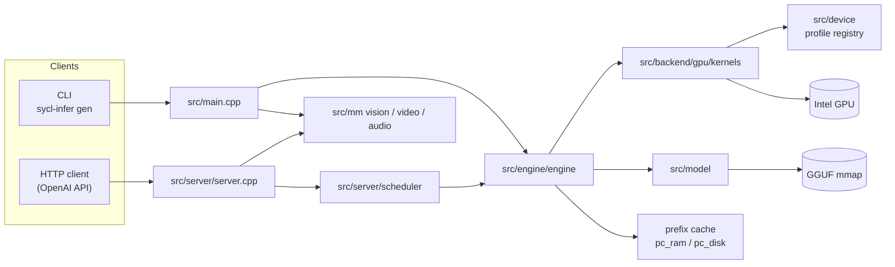
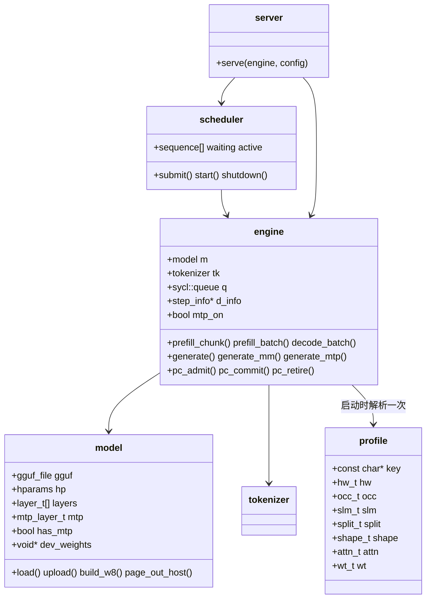
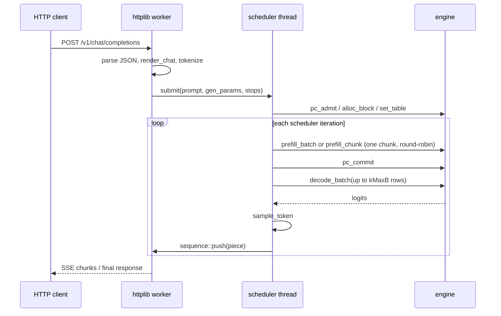

# 总体架构设计

本文描述 `sycl-infer` 的整体架构：系统边界、模块划分、运行时对象模型、请求数据流、线程与设备
内存模型，以及贯穿全项目的设计原则和不变量。各子系统的细节见 `docs/design/`。

---

## 1. 目标与设计原则

`sycl-infer` 是一个从零实现的 C++17 + SYCL 的 LLM 推理引擎，面向 Intel GPU 上的量化 GGUF 模型。
开发与验证的参考模型是 **Qwen3.5-0.8B Q4_K_M**（Intel Iris Xe-LP），但引擎本身不绑定具体模型。

核心设计原则：

1. **架构无关（pluggable architecture）**。模型类型由 GGUF 的 `general.architecture` 决定，通过
   `src/model/model_arch.h` + `model.cpp` 中的注册表分发。新增模型架构 = 新增一个 `.cpp` + 一行注册,
   无需改动引擎或 kernel。见 [design/01-model-loading.md](design/01-model-loading.md)。
2. **量化权重零转换加载**。GGUF 文件以只读 `mmap` 映射，整个映射一次性拷贝到设备，所有设备指针
   都通过“相对 `map_base` 的偏移”从主机指针推导（`model::dev_ptr`）。见
   [design/01-model-loading.md](design/01-model-loading.md)。
3. **kernel 库与编排分离**。每个 kernel 一个编译单元，公开的启动 API 集中在
   `src/backend/gpu/kernels/kernels.h`；共享的设备辅助函数在 `src/backend/gpu/kernels/kernel_utils.h`（`si::kd`）。kernel 体
   不放在头文件里。
4. **图优先执行（graph-first）**。完整的 forward step 按形状一次性录制为 SYCL command graph，之后
   逐步重放，把每 token 的启动开销压到最低。见 [design/04-engine.md](design/04-engine.md)。
5. **所有逐步状态放在 host-USM 的 `step_info` 里，在 kernel 体内读取**。图录制时被主机读取的值会被
   冻结进图，因此任何随 step 变化的值（位置、token id、`n_real`、active 行）都必须在 kernel 内读取。
   这是项目最重要的不变量。
6. **面向集显的带宽优先**。Iris Xe-LP 是内存带宽受限平台，因此：int8 KV 默认；SIn 权重格式按 warp
   合并访问重排；prefill 阻塞批处理让权重保持 L2 热。见 [design/02-quantization.md](design/02-quantization.md)。
7. **设备代码必须持续可用**。GPU（`sycl::gpu_selector_v`）是默认后端；CPU 后端（`src/backend/cpu`，手写
   AVX2 / AVX-VNNI / AVX-512 内核）与 GPU 后端共享同一套 `compute_backend` 接口，可通过
   `--device cpu|gpu|auto` 选择。多设备（层放置）见 §11。
8. **在某张卡上量出来的常量属于那张卡的 profile，不属于代码里的字面量**。占用波（warps/EU）、
   SLM 预算、split 阈值、原生权重格式的默认开关、`rmsnorm` 的 work-group 宽度都随卡变化。
   它们集中在 `src/device/`：一张卡一个文件（`src/device/profiles/<card>.cpp` 同时给出 key、取值和
   自己的 matcher），`src/device/device_registry.cpp` 只按 SYCL 报告的设备名挑一份并缓存。
   没被认领的卡拿到 `key=unknown` 的 profile 并打印 WARNING，而不是静默继承上一张卡的调优。
   见 §11.3。

---

## 2. 系统上下文



两个入口共用同一个 `si::engine` 实例：

* **CLI**（`main.cpp`）：`gen` 单序列生成，`serve` 启动 HTTP 服务。多模态走
  `mm_build_prompt_device` / `mm_build_prompt_mixed_device` + `engine::generate_mm`。
* **HTTP 服务**（`server.cpp`）：OpenAI 兼容 API。文本请求经 `scheduler` 做连续批处理；多模态请求
  绕开调度器，单序列串行执行。
* **MTP 投机解码**（`--mtp N`，`src/engine/engine_mtp.cpp`）：贪心（`temperature <= 0` 或
  `top_k == 1`）且非多模态的请求在 `engine::generate_impl` 内部改走 draft/verify 循环
  （`engine::generate_impl` 的 MTP/DFlash 分派条件）。服务端**默认**仍把贪心请求交给调度器，只有 `PF_MTP_SERVER=1`
  时 `server.cpp` 的 `mtp_direct` 才绕过调度器直送单序列 MTP 循环（`src/server/server.cpp:901`）——
  因为 MTP 与 decode 批处理争同一份权重带宽。见 §12。

---

## 3. 模块划分

```
src/common/     量化格式与底层公共设施
                quant.h       ggml block 布局 + 主机端反量化参考
                w8.{h,cpp}    SIn int8 权重格式：重排、尺寸、Q6_K scale-only 优化
                w4.{h,cpp}    原生位宽 u4 / k5 / cb4 / w2 权重的打包（per-32 f16 step+offset）
                dp4a.h        可移植的 dp4a 辅助
                rope.h        RoPE 角度（各 caller 共用）
                yarn.h        YaRN 上下文扩展：每对维度的频率表（`--yarn`，默认关）
                cpu_isa.{h,cpp}  主机 CPU 指令集检测与运行时变体选择

src/device/     设备 profile：按 GPU 型号存放所有“在这张卡上量出来”的常量
                device_profile.h   profile 结构体 + 注册表 API（si::dev）
                device_registry.cpp kDevices[]、for_name()、active()、wg_clamped()、
                                   PF_DEVICE_INFO 报告、unknown 回落
                profiles/arc_a770.cpp   一张卡的完整实现：key / 取值 / matcher
                profiles/iris_xe.cpp    同上（大部分取值标注为 INHERITED）

src/backend/    backend.h       compute_backend 抽象（共享接口 + 工厂）
                gpu/gpu_backend.cpp   转发到 SYCL kernel 库
                cpu/cpu_backend.cpp   转换 POD 后调用主机内核
                cpu/cpu_types.h       无 SYCL 的镜像结构 + 启动声明
                dnnl_gemm.{h,cpp}  权重路径调度器：oneDNN int8 matmul（PF_GEMM_DNNL）+
                                   M<=13 的原生精度批 GEMM（nat_gemm_launch）+
                                   attn_xmx 用的 attn_qk/attn_pv

src/backend/cpu/kernels/    每个主机 kernel 一个 .cpp（编译时 `-fno-sycl`，可带 AVX2 /
                AVX-VNNI / AVX-512 target attribute；结构类内核为标量）：
                common（线程池 + ISA 分派 + 反量化/RMSNorm 辅助）, rmsnorm,
                embed, copy_row, gemv, qk_norm_rope, attn, conv, gdn,
                gated_norm, xq, dp4a, i8（GGUF 整数 GEMV）

src/backend/gpu/kernels/    kernels.h      公开启动 API + step_info + gemv_seg + 常量
                kernel_utils.h 共享设备辅助（si::kd）：反量化、KV 访问、子组归约、gemm_ws
                kv_type.{h,cpp} KV 存储类型选择与字节几何
                每个 kernel 一个 .cpp：rmsnorm, embed, copy_row, gemv,
                qk_norm_rope, attn, conv, gdn, gated_norm, xq,
                dp4a_gemv, dp4a_gemm（+ dp4a_common 共享 split-K workspace）,
                w4_gemv（u4 / k5 / cb4 / w2 各类原生权重 GEMV+GEMM、nat_gemm_launch、
                        融合窄 int8 调用组 i8_grp_gemv_rows_multi_launch）,
                attn_xmx（oneDNN int8 matmul 的 prefill attention）,
                mtp / mtp_argmax（MTP draft head 输入准备、accept argmax、
                        候选受限 draft head）,
                vit（视觉编码器）, at（音频塔辅助：at_conv1d / at_rope1d）

src/model/      gguf.{h,cpp}       GGUF 解析 + mmap
                model.{h,cpp}      通用加载/上传 + 绑定辅助
                model_arch.h       架构注册表接口
                qwen35.cpp         Qwen3.5 混合架构加载器
                model_w8.cpp       SIn int8 权重副本的构建/释放
                tokenizer.{h,cpp}  BPE 分词器

src/mm/         image.{h,cpp}        解码 + Qwen 智能缩放/归一化/patchify
                vision.{h,cpp}       mmproj 加载 + 视觉编码器（host + device）
                video.{h,cpp}        视频解码 + 均匀抽帧
                audio.{h,cpp}        音频解码（WAV 原生 / ffmpeg 回退）+ log-mel
                audio_model.{h,cpp}  音频塔（host + device）
                multimodal.{h,cpp}   提示词扩展 + M-RoPE 位置（图像/视频/音频/混合）

src/engine/     engine.{h,cpp}             编排、缓冲区、单序列 API、MTP 门控
                engine_graph.cpp           seg_plan、record_forward、build_graphs、
                                           多设备 decode / MTP verify 的分段 command graph
                engine_mtp.cpp             MTP plan / draft / verify / commit / rollback +
                                           投机循环
                engine_kvpool.cpp          动态 KV 块池
                engine_prefix_cache.cpp    前缀缓存（VRAM 层 + 三层调度）
                pc_ram.{h,cpp}             主机 RAM 层
                pc_disk.{h,cpp}            磁盘层（记录格式、索引、LRU）
                sampler.{h,cpp}            采样

src/server/     server.{h,cpp}         httplib 服务、JSON、SSE、多模态接入
                scheduler.{h,cpp}      连续批处理调度器
                chat.{h,cpp}           渲染 + 内置 ChatML 回退
                chat_template.{h,cpp}  minja Jinja 封装
                chat_util.h            UTF-8 边界安全的流式缓冲
                response_parser.{h,cpp} 流式 reasoning_content / content / tool_calls 拆分

src/main.cpp    CLI

third_party/    httplib.h, json.hpp, minja/, unicode 表, stb_image.h
```

`src/` 与 `tests/` 是平行结构：每个 kernel / kernel stage 一个文件。

---

## 4. 运行时对象模型



### `si::model`
静态权重：GGUF 的内存映射、解析出的超参数 `hparams`、每层 `layer_t`（张量视图）、整个 GGUF 的
设备副本 `dev_weights`，以及可选的 SIn int8 权重副本。GGUF 若随模型附带一个 NextN 块
（`qwen35.nextn_predict_layers`），它被绑成独立的 `mtp_layer_t mtp` 并置 `has_mtp = true`；
没有它时 `--mtp` 会被引擎门控掉（§12）。见 [design/01-model-loading.md](design/01-model-loading.md)。

### `si::tokenizer`
从同一个 GGUF 构建的 GPT-2 byte-level BPE 词表，含特殊 token id（`eos`/`eot`/`pad`/`im_start` 等）。
见 [design/08-tokenizer.md](design/08-tokenizer.md)。

### `si::engine`
系统的核心。持有 `sycl::queue`（**in_order**）、所有激活缓冲区、paged KV 池、递归状态、录制好的
command graph、前缀缓存三层，以及可选的 MTP 草稿层与它自己的 KV 切片。对外提供两类 API：

* **批处理 API**（调度器使用）：`prefill_chunk`、`prefill_batch`、`decode_batch`、`fetch_logits`，
  调用者必须持有 `engine::mtx`。
* **单序列 API**（CLI/测试/多模态）：`eval`、`generate`、`generate_mm`，内部自己加锁
  （`src/engine/engine.cpp:2323`、`2348`、`2354`）。

### `si::server` / `si::scheduler`
HTTP 层与连续批处理层。一个 `engine` + 一个 `scheduler` 线程；httplib 工作线程只做解析/编码和阻塞
等待输出队列。见 [design/09-server.md](design/09-server.md)。

### `si::dev::profile`
进程内按 GPU 型号解析一次（`si::dev::active()`），把“在这张卡上量出来”的常量集中在一处，
供 kernel launcher 与引擎读取（`si::dev::active().<group>.<field>`）。见 §11.3。

---

## 5. 请求数据流

### 5.1 文本请求（连续批处理路径）



调度器每个外层循环：先给一个 active 序列做一个 prefill step（round-robin、公平），再做一次最多
`kMaxB` 行的批量 decode。prefill 与 decode 因此交错执行。prefill 步本身优先取 mode-2 的
`prefill_batch`（`batched_prefill_fit` 给出的最大整块），只有尾部或无批量变体时退回 `prefill_chunk`。
细节见 [design/09-server.md](design/09-server.md)。

### 5.2 一次 forward step（引擎内部）

```
embed → for each layer:
    rmsnorm(attn_norm) → [GDN 层: gemv(wqkv/wgate/ssm_beta/ssm_alpha) → conv → gdn → gated_norm → gemv(ssm_out)]
                       [attn 层: gemv(wq/wk/wv) → qk_norm_rope → attn(+combine) → gemv(wo)]
    rmsnorm(post_attn_norm) → gemv(ffn_gate+ffn_up) → gemv(ffn_down)
rmsnorm(output_norm) → [copy_row] → gemv(LM head)
```

该顺序被编码进 `seg_plan`（`engine::build_plan`），`record_forward` 必须严格按同一顺序发射 kernel。
LM head 的 call 固定挂在主设备（`cur_dev = 0`），见 §9 不变量 9。见
[design/04-engine.md](design/04-engine.md)。

### 5.3 引擎按形状挑选的可选加速路径

有几个 kernel 不是“每层都跑”，而是引擎在运行时按形状挑进来的。它们的**选择**在引擎与
`dnnl_gemm` 一侧，**kernel 设计**在 [design/03-kernels.md](design/03-kernels.md)：

| 路径 | 谁选它 | 触发条件 |
|---|---|---|
| `attn_xmx_launch`（oneDNN int8 matmul 的 prefill attention，`attn_xmx.cpp`） | `attn_launch` 内部（`src/backend/gpu/kernels/attn.cpp:322`） | `n_real > 1 && head_dim == 256`；`PF_ATTN_XMX` 未关时默认开（取自 profile 的 `attn.xmx`），key 数 < `PF_ATTN_XMX_MIN`（A770 默认 2048）或不在 i8-KV / oneDNN 范围内时返回 false，回落经典 kernel |
| `nat_gemm_launch`（M ≤ 13 的批量原生精度 GEMM，`w4_gemv.cpp`） | `dnnl_gemm::gemm` / `gemm_w4`（`src/backend/dnnl_gemm.cpp:1267`、`1324`、`1376`、`1440`） | `2 <= M <= 13 && K % 32 == 0`，且调用点是 decode / MTP verify（激活的 even/odd 分组视图有效，即 `p->split_valid`）；`PF_NAT=0` 全局关掉 |
| `i8_grp_gemv_rows_multi_launch`（把一个 call group 的窄 int8 段融成一次 launch） | `record_forward` 的 `gemv_at`（`src/engine/engine_graph.cpp:708`） | `tbm <= 13` 且组内多于一整段；`PF_NOFUSE=1` 关掉 |
| `dp4a_gemm` 的 split-K partial 和 | `kd::gemm_ws`（`src/backend/gpu/kernels/dp4a_common.cpp:10`） | 需要 K-split 时按需增长的设备 workspace；chunk 批 prefill 下每行一个槽位 |
| `mtp_argmax_launch`（设备端 per-row argmax） | `compute_backend::mtp_argmax`（`src/backend/gpu/gpu_backend.cpp:39`） | 仅 MTP verify 用；CPU 后端在 `cpu_backend.cpp` 里用主机循环实现同一入口 |

prefill 的 `M` 是**整批 token 数**（mode 2 下 `rows`，见 `record_forward` 的 `tbm`），所以
`nat_gemm` 的 `M <= 13` 窗口在长 prompt 上不会命中——它服务的是 decode 与 MTP verify，而不是
prefill；prefill 走 oneDNN 的 `PF_GEMM_DNNL` 路径。见 §9 不变量 3 与 §12。

---

## 6. 线程与并发模型

| 执行体 | 职责 | 同步 |
|---|---|---|
| httplib 工作线程池 | JSON 解析、chat 渲染、分词、SSE/non-stream 输出 | 每个 `sequence` 自带 mutex+cv（`src/server/scheduler.h:51`） |
| 调度器线程（1 个） | 准入、prefill、decode、采样、推送 token | 先 `engine::mtx`，再取 `scheduler::m`；引擎调用前后释放 `m` |
| CLI 主线程 | 单序列生成 | `engine::mtx`（在 `generate` 内部获取） |
| httplib 多模态生产者线程 | `generate_mm` 流式输出 | `serve()` 的共享 `media_gate` 请求许可 + 设备编码/生成时的 `engine::mtx` |
| 信号 watchdog 线程 | 每 100 ms 轮询终止标志，调用 `srv.stop()` | 原子标志 `g_term_requested` |

* **所有引擎执行由 `engine::mtx` 串行化**。调用 `prefill_*`/`decode_batch` 的代码必须持有该锁。
* 锁的获取顺序固定为 `engine::mtx` → `scheduler::m`，不存在反向路径。
* **调度器在调用引擎时必须释放 `scheduler::m`**（`src/server/scheduler.cpp:234`、`238`、`360`）。
  曾经在整个外层循环里持有它，导致 `submit()` 被饿死：每个请求都要等上一个生成**结束**才被准入，
  两条跨序列批处理路径都成了死代码。改成 `std::unique_lock` 在引擎调用前后 unlock/lock 之后，
  27B（temperature 0、`ignore_eos`、每请求 128 token）上 N=1/2/4/8 个并发请求的聚合吞吐是
  14.3 / 24.5 / 40.1 / 55.0 tok/s（N=8 相对单请求 3.85x）。
* 代价：并发会牺牲逐位一致——同一贪心提示在 N 个并发请求下有 1 行逐字节相同，其余可能在近似的
  argmax 平局处翻转（实测翻在 "attention mechanism" / "**Scaled Dot-Product Attention**" 一处），
  是批量 GEMM 的 fp 累加顺序不同，不是竞态。细节见 [AGENTS.md](../AGENTS.md)。
* 多模态请求全程持有 `media_gate` 许可，因为所有请求共享 `engine::d_img_embd`。
  许可可以在另一个线程释放；底层 `std::mutex` 不跨线程转交。媒体设备编码另持
  `engine::mtx`，避免与调度器的前向执行交错。
* 信号处理器只置原子标志（async-signal-safe）；watchdog 线程每 100 ms 轮询后正常停止服务器
  （`server.cpp` 的 `serve()` 内 watchdog 线程），从而保证 `~engine` 里 `pc_flush_to_disk()` 把前缀缓存
  VRAM/RAM 层落盘（`src/engine/engine.cpp:523`）。

---

## 7. 设备内存模型

引擎启动时一次性分配（见 `engine::alloc_buffers` 与 [design/04-engine.md](design/04-engine.md)）：

| 区域 | 说明 |
|---|---|
| `dev_weights` | 整个 GGUF 映射的副本（由 `model::upload` 分配） |
| SIn 权重副本 | `PF_DP4A` 打开时约 700 MB（`model::build_w8`） |
| 激活缓冲 | 行数 `R = kMaxB*kMaxT = 512`（`src/engine/engine.cpp:957` 的 `alloc_act_set`），各阶段按需分配 |
| KV 池 | 虚拟 USM 预留 + 物理 extent 按需提交（`engine_kvpool.cpp`） |
| 递归状态 | `d_gdn_state`、`d_conv_state`，每序列一个 slot；slot 轴是 `state_slots_`（`--max-slots`，默认 `kMaxB`）而不是 `kMaxB`——27B 上每卡 1.125 GiB，单流长上下文只需一个 slot（`src/engine/engine.h`） |
| 前缀缓存检查点 | `d_pc_states[pc_max_states][pc_state_floats]`（`src/engine/engine.cpp:2205`） |
| MTP 缓冲 | `d_mtp_*`：草稿层的激活、per-token 递归状态快照（`d_mtp_hist_`）、候选集；MTP 开时才有（`src/engine/engine.h:459` 起） |
| command graph | 单设备：decode 桶 `1/2/4/8/16` + prefill 变体；多设备：每个连续设备段一份 decode 图 + MTP verify 图 |

KV 池的地址范围只预留一次，物理内存按 extent 提交/解映射，这样录制进图的每层基址指针在池增长时
仍然有效。见 [design/05-kv-cache.md](design/05-kv-cache.md)。

**两条路径不走虚拟 USM**（都把 `kv_virtual` 置 false 并一次性提交 `pool_cap`）：

* `cpu_mode`：`engine::kv_setup` 用 `sycl::malloc_host` 提交主机 USM（`engine::kv_setup` 的 `cpu_mode` 分支）。
* `multi_dev`：每设备一个池，只含该设备计算的注意力层（`engine_kvpool.cpp` 的 `kv_setup` 多设备分支）。

另外 `attn_xmx` 的 scratch（gather 后的连续 KV + query 堆叠区）按 **queue 地址** 索引而不是函数内
static——两个 `--layer-map` 设备各有自己的队列，共用一份 scratch 会被跨设备 USM 访问拖慢
（`src/backend/gpu/kernels/attn_xmx.cpp:151`）。

---

## 8. 关键常量

| 常量 | 值 | 含义 |
|---|---|---|
| `kMaxT` | 32 | 每行最大 prefill token 数 |
| `kMaxB` | 16 | 并发序列数的**硬上限**（`step_info` 行数、block 表、`d_logits`）；实际分配由 `--max-slots` 的 `state_slots_` 决定 |
| `kMaxRows` | 32 | 每 token 缓冲的最大行数 |
| `kBlockSize` | 32 | paged KV 块大小（token） |
| `kI8Q` | 32 | int8/int4 KV 每多少 head dim 一个 scale |
| `kMaxSplits` | 64 | prefill attention K-split 容量 |
| `kMaxDecSplits` | 512 | decode K-split 容量（**硬上限**，实际值按 EU 数推导，见下） |
| `kPcMapLen` | 1024 | 前缀缓存检查点边界映射长度（覆盖 32768 token） |
| `kMaxImgTokens` | 1024 | 单图最大合并视觉 token 数 |
| `kMaxImgPatches` | 4096 | 单图最大 ViT patch token 数（= 4 × 合并 token） |

定义在 `src/backend/gpu/kernels/kernels.h:11-33`。修改这些常量会改变设备内存占用，也会改变录制图的
形状集合。

**`kMaxDecSplits` 只是天花板**，真实的 `dec_splits` 由设备推导
（`engine.cpp` 里解 `dec_splits` 的那段）：`(warps_per_eu_x2/2) * max_compute_units / n_head`，向下取整到 8 的
倍数、下限 8、上限 `kMaxDecSplits`。`warps_per_eu_x2` 来自设备 profile（`occ` 组），因为它是这张卡
的子组晶格属性。解码注意力是**占用**受限而非带宽受限的：每层发 `n_head * dec_splits` 个 32 线程
warp，一个 Xe-LP EU 装得下 8 个，超过就不共驻、时间上台阶。实测单层（27B 形状、i8 KV、64k 深度、
attn+combine ms）nsp = 64/128/**160**/168/176 → 3.05/2.18/1.70/1.74/2.68，176（8.25 warp/EU）
就是悬崖。`PF_DEC_SPLIT=N` 可覆盖。

---

## 9. 全局不变量

1. **图冻结主机读取值**。`record_forward` 期间主机读到的值会被烘焙进 command graph。逐步状态必须
   存放在 host-USM 的 `step_info` 中并在 kernel 体内读取。见 [design/04-engine.md](design/04-engine.md)。
2. **`record_forward` 与 `build_plan` 的调用顺序必须同步**。plan 编码每个 call 的边界，forward 必须按
   相同顺序消费；末端 LM head 是最后一个 call。**部分（按设备分段的）`record_forward` 必须把 call
   游标起始于该 phase 的第一层**，用 `seg_plan::layer_c0` 而不是 0——`ci` 索引的是 plan 全局的
   `call_tb`/`call_xq`/`call_group_*`，从 0 起步会让后面的分区读第一层的 call 元数据（`dnnl_call`
   转 false，组落回 fp32 `gemv_group`，层静默不写东西）。
3. **oneDNN 不能录制进 SYCL 图**。`PF_GEMM_DNNL` 路径直接重放模式 2（`prefill_batch`）。多设备的
   MTP verify 图声明自己必须是全 SYCL，并用 `dnnl_capture_guard`（`engine_graph.cpp` 的 `dnnl_capture_guard`
   布防，`dnnl_gemm.cpp` 的 `dnnl_capture_guard` 检查点 在每个 `prim.execute` 处检查并抛异常）——一个无法服务的
   形状不会静默录出一份缺活的图。
4. **不要多个 TU 包含 `sycl/ext/oneapi/dot_product.hpp`**（其函数在该工具链下不是 `inline`），统一用
   `src/common/dp4a.h`。
5. **int8/int4 KV 布局**是 `[block][kv head][token][head_dim]`（i4 为 `head_dim/2` 个打包字节）数据 +
   独立的 fp16 scale 平面；池与 scale 都按字节推进（`kv_layer_stride`、`kv_scale_stride`）。
6. **多模态下 KV slot 序号与 RoPE 位置分离**：图像消耗 `max(nx,ny)` 个位置却有 `4*nx*ny` 个 token，
   decode 时 `info->pos` 是 token 计数，RoPE 位置由 `step_info::mrope` 携带（`mrope_on`）。
7. **图像 token 不经过 `tok_embd`**：embed kernel 直接拷贝 `step_info::img_embd[img_row[t]]`。
8. **多模态路径绕过前缀缓存**，使用单序列 `engine::generate_mm`。
9. **plan 是设备指针快照**。`build_plan` 把构建时的 `d_x*` 成员写进 `gemv_seg`；multi-device 下
   `bind_acts(dev)` 会把成员切到各设备的缓冲（`as_[dev]`）且**不会**回头修改已构建的 plan。因此
   "固定在 primary 上执行"的段（LM head，`dev = 0`）必须在 `bind_acts(0)` 之后构建，否则会捕获最后一层
   所在设备的激活缓冲。见 [design/04-engine.md](design/04-engine.md) §4.2。
10. **解码与前向必须数值一致**。同一序列"单 token decode"与"重新 prefill"的结果必须一致（
    `test_decode_vs_prefill`）；任何只影响单 token 路径的改动都要用该测试验证——纯 prefill 的测试对
    解码路径是盲区。见 [design/12-build-and-testing.md](design/12-build-and-testing.md) §7。
11. **kernel launcher 里绝不做设备查询**。`rmsnorm_launch` 每次启动都调 `si::dev::wg_clamped()`
    （`gpu/kernels/rmsnorm.cpp` 的 `rmsnorm_launch`（`wg_clamped` 调用点）），所以那里的
    `sycl::device::get_devices()` + `get_info<max_work_group_size>()` 必须缓存（它在
    `device_registry.cpp` 的 `for_queue` 函数内 static 的函数内 static 里，只查一次）。未缓存时实测**每次调用
    3.2 ms**，一次 MTP verify 的 65 次 rmsnorm 就是 **210 ms 纯 host 时间**；数字与理由记在
    `device_registry.cpp` 里未知卡回退处的注释与 [AGENTS.md](../AGENTS.md)（测量条件：27B / 2x A770、
    `--layer-map 0-31:gpu.0,32-63:gpu.1` 的 MTP 配置）。这个 bug 在普通 decode 的数字里**看不见**，
    因为 decode 是启动时录一次、之后重放的 command graph，而当时的 verify 是直接重放 kernel 的。
    同理 `si::dev::active()` 也只解析一次（`device_registry.cpp` 的 `active()`）。
12. **喂给原生权重 GEMV 的激活必须用 `do_split=true` 量化**。`nat_gemm_launch` 的四个格式入口
    （u4 / k5 / cb4 / int8）读的都是 even/odd 分组激活视图，`dnnl_gemm` 用 `p->split_valid` 把它们
    限制在 decode / `mtp_dry` verify 上（`src/backend/dnnl_gemm.cpp:1323`、`1375`、`1439`；
    k5 见 `1266`）；mode-1/mode-2 prefill 用 `do_split=false` 量化，缺了这个守卫会读到
    **上一次调用**的分组视图，静默污染 0.8B 的多设备 decode-vs-prefill。`PF_NAT=0` 是二分开关。
13. **`hparams::qkv_dim()` 不是 `3*d_inner`**，`m.output` 也不总是 `m.tok_embd`：这两条只在 0.8B 上
    成立（0.8B 恰好 `n_group == dt_rank == 16`，且 `output.weight` 缺失）。用
    `hp.qkv_dim()` 取 GDN qkv/conv 宽度、用 `m.output` 取 LM head。
14. **GDN 的 head 配对是取模，注意力 GQA 是分块**——不要统一。前者 `gdn.cpp` 把 value head `h` 与
    q/k head `h % n_group` 配对，后者 `attn.cpp` 用 `kvh = h*n_head_kv/n_head` 展开（GQA 的
    `repeat_kv`）。两者只在 head 数相等时一致，也就是只有 0.8B 参考模型；弄错在 0.8B 上不可见、
    在 27B（16 vs 48）上是致命的。
15. **部分填充的 mode-2 批必须走 oneDNN 权重路径**。`batched_prefill_fit` 只在 `use_dnnl` 或某个
    GPU 分区有 oneDNN（`dnnl_any_dev()`）时允许最后一行 `n_real_row < kMaxT`；`md_int8` 的 dp4a GEMM
    只对整 `kMaxT` 行正确，放它接部分批会静默污染隐状态。全 `cpu` 的 `--layer-map` 必须选 CPU 队列
    （`resolve_device`），不能落到默认 GPU 队列。
16. **跨序列 prefill 批处理没有开启**。把多个提示打包进一次 mode-2 前向（行主序拼接 token，
    per-row `slot`/`pos`/`n_real_row`）已实现但产出的是退化续写而不是可信的多个候选，即使把 decode
    批压到 1 也如此——故障在某个读取 plan 期状态的东西上，而不是 `step_info`（它已经带 per-row 字段）。
    所以 prefill 仍是一序列一次（约 300 ms）；上面的 3.85x 是纯 decode 批处理。

---

## 10. 扩展点

* **新增模型架构**：[design/01-model-loading.md](design/01-model-loading.md)。
* **新增 GPU 卡（device profile）**：新增 `src/device/profiles/<card>.cpp`——一份完整实现，
  含 key、取值和**自己的** matcher——再在 `src/device/device_registry.cpp:22` 的 `kDevices[]` 加一行。
  顺序即匹配顺序（先匹配先赢），宽泛的 matcher 放在具体 matcher 之后。取值必须写指定初始化器
  （`.key = ...`、`.shape = {.rmsnorm_wg = ...}`），并且**在文件里注明每个值的来源**；从别的卡
  搬过来但没有重测的，标 `INHERITED`。未识别的卡会拿 `key=unknown` 的 profile 并打 WARNING，
  所以漏掉一张卡的后果是明显的，但仍然不是正确调优。规则见 §11.3 与 [AGENTS.md](../AGENTS.md)。
* **新增 kernel**：[design/03-kernels.md](design/03-kernels.md)。若它需要新的启动入口，同时在
  `src/backend/backend.h` 的 `compute_backend` 上加同名虚函数并实现 GPU / CPU 两份。
* **新增 kernel stage 测试**：[design/12-build-and-testing.md](design/12-build-and-testing.md)。
* **新增 KV 存储类型**：`src/backend/gpu/kernels/kv_type.{h,cpp}`（枚举 + 解析 + 字节几何），
  再看 `attn.cpp` / `qk_norm_rope.cpp` 的存储分支与 scale 平面是否要跟着改。
* **新增多模态模态**：[design/10-multimodal.md](design/10-multimodal.md)、
  [design/13-audio-video.md](design/13-audio-video.md)。
* **新增服务端点**：[design/09-server.md](design/09-server.md)。
* **前缀缓存策略**：[design/06-prefix-cache.md](design/06-prefix-cache.md)。

任何改动都应遵守 [AGENTS.md](../AGENTS.md) 的“Quick verification”流程：构建无警告、
`test_gpu_stages` / `test_gpu_vs_ref` / `test_forward` 通过、`clang-tidy` include-cleaner 干净。

---

## 11. 设备选择与多设备执行

### 11.1 后端抽象

`src/backend/backend.h` 的 `compute_backend` 是 `src/backend/gpu/kernels/kernels.h` 启动 API 的一一镜像
（RMSNorm / embed / GEMV / paged attention / conv / GDN / gated_norm / xq / dp4a / i8，以及
`mtp_capture` / `mtp_concat` / `mtp_argmax` / `mtp_cand` / `mtp_gather` / `mtp_gather_argmax` 这一组
MTP 入口）。引擎的 `record_forward` 只调用 `compute_backend`，因此同一份前向逻辑可以：

* `gpu_backend`：把调用直接转发给 SYCL kernel；`record_forward` 在 command graph 录制期间调用它。
* `cpu_backend`：把 `step_info` / `gemv_seg` 转换成无 SYCL 的镜像 POD，再调用 `src/backend/cpu` 的主机内核。

后端是**单设备**的：一个后端拥有一个队列/设备（或主机 CPU）。多设备是"每层分区一个后端"的组合
（`src/backend/backend.h:13`）。

`src/backend/cpu/kernels/` 用 `-fno-sycl` 单独编译，因此可以安全地使用 `<immintrin.h>` 与
`__attribute__((target(...)))`，且不进入 SYCL device pass。热点循环按 `src/common/cpu_isa.h`
在运行期选择 AVX2 / AVX-VNNI / AVX-512（int8 点积用 VNNI 的 `dpbusd`，否则 AVX2
`maddubs+madd`；fp32 归约/点积同理）。`PF_CPU_ISA=scalar|avx2|avx512|avxvnni` 可强制变体；
CPU worker 线程数由 `--cpu-threads N` 或 `PF_CPU_THREADS` 指定（默认 = 物理核数，探测失败时回退到硬件并发，
见 `src/backend/cpu/kernels/common.cpp` 的 ISA dispatch）。

CPU 后端默认跑 **从 GGUF block 直接提取的整数 int8 GEMV**（`kernels/i8.cpp`，
Q4_K/Q5_K/Q6_K；Q8_0 与未知格式回退到 `common.cpp` 的融合 fp32 `qgemv_sb_*`），
激活由 `cpu_xq` 量化；不需要也不构建 GPU 用的 SIn w8 副本（约 700 MB）。`PF_DP4A=0`
强制融合 fp32 路径。不使用 oneDNN、不使用虚拟 USM，KV 池是普通主机 USM
（`engine::kv_setup` 的 `cpu_mode` 分支），所有引擎 scratch 用 `sycl::malloc_host` 分配。
由于没有 command graph，`prefill_chunk` / `decode_batch` 直接调用 `record_forward`
（与 `PF_NOGRAPH` 相同的直放路径）。

### 11.2 多设备层放置（pipeline parallel）

`--layer-map 0-11:gpu,12-23:cpu` 把层区间映射到设备（`gpu` / `gpu.N` / `cpu` / `host` / `1`），
每个区间是**闭区间**且必须无缝隙地覆盖 `[0, n_layer)`。多 GPU 区间共享**一个** SYCL context
（host USM 是 context 作用域的，否则第二张卡上的激活会间歇性出错，
`src/engine/engine.h:119`）。**多个 GPU 可以解析到不同的调优 profile**（例如 A770 + Iris Xe）：
这是**支持的配置而不是错误**，每张卡按自己的队列解析 profile（`si::dev::for_queue(q)` /
`wg_clamped_for_queue(q, want)`，每次 launch 0.039 µs），并在 `PF_DEVICE_INFO=1` 下报告混合情况。
这不只是调优问题——A770 接受 1024 线程的工作组而 Iris Xe 只接受 512，用进程级单一的
`active()` 会让第二张卡**launch 失败**（不是变慢）。**多设备之间是 pipeline parallel（层区间流水）**：
设备 `d` 计算自己的层区间，算完后把隐藏状态交给下一个设备。具体地：

* `backends_` 每个设备一个后端；`layer_dev_[il]` 决定每层用哪个后端，`record_forward` 在**分区边界**
  调 `handoff_x(prev_dev, dev, nrows * nreal)`（`src/engine/engine_graph.cpp:903`），再
  `bind_acts(dev)` 切成员。这就是 pipeline 的 stage 交接点，两个要点：
  (1) `handoff_x`（`src/engine/engine.cpp:796`）先在**源设备的队列**上 `wait()`——command graph 只排序
  已录制的依赖，不排序这些手工提交的拷贝——再经一块 host USM 暂存缓冲拷到目标设备的
  `as_[to].x`（in-order 队列保证目标端自己的 kernel 在这次拷贝之后）；目标设备是 CPU 分区时
  `as_[to].x` 本身就是主机 USM（`dev_alloc_on` 对 `dev_kind == cpu` 走 `sycl::malloc_host`）。
  (2) 只拷**活着的那些行**：激活布局是 `[token][n_embd]`，所以单 token decode 拷 1 行而不是整个
  `kMaxB*kMaxT`——旧的全量拷贝每次交接搬 10.5 MB，一个 token 的 decode 要搬两次。
* GPU 后端只上传它自己那部分层（加全局 tok_embd / output_norm）的权重张量，CPU 后端直接读 mmap；
  `wptr(dev, host)` 通过 `weight_maps_` 为每个权重张量解析出该设备的指针，`build_plan` 因此能生成一份
  含正确指针的计划。GPU 显存不再持有整份 GGUF 副本。
* **KV 按设备分开**：`layer_attn_local_[il]` 给出该层在所属设备注意力层中的序号，
  `dev_kpool_` / `dev_vpool_` / `dev_kscales_` / `dev_vscales_` 只包含该设备的注意力层。
  block id 是全局的（同一张 block table），所以 paged attention 与 `set_table` 无需改动。
  这条路径不走虚拟 USM：`kv_setup` 把每设备的池一次性提交到 `pool_cap`
  （`engine_kvpool.cpp` 的 `kv_setup` 多设备分支）。
* **前缀缓存可用**——block id 全局，且多设备下 `host_act = true`（`src/engine/engine.cpp:1546`）让引擎
  scratch（含 `d_pc_states` 递归状态检查点池）整体走 `sycl::malloc_host`，所以三层缓存的记录在所有
  设备之间共享；`pc_serialize_block` / `pc_deserialize_block` 经 `kv_layer_ptrs` 按设备解析每层的池。
  注意**每分区自己的递归状态在它自己的 USM 里**（`as_[dev].gdn_state` / `conv_state`，只含该分区的
  GDN 层），状态从不跨分区边界——跨的只有隐藏激活。整模型 SIn w8 预留不建，但有两条 int8 权重路径，
  按设备支持情况择优（`src/engine/engine.cpp:1605`）：
  - **oneDNN int8（`md_xmx`，同时服务 prefill 与 decode）**：每 GPU 后端各持有一份绑定该设备队列的
    `dnnl_gemm`（`dnnl_dev_`），只转换该设备分区的层权重。CPU 分区层走直读 GGUF 块的 i8 路径
    （`PF_GEMM_DNNL=0` 或 `PF_DP4A=0` 关掉这种多设备 oneDNN）。
  - **SIn/w8 dp4a（`md_int8`，oneDNN 不可用时）**：为分区里的层各建一份 SIn w8 副本（`w8_dev_`），
    单序列 decode 走 `plan_dec8_`：GPU 层 `dp4a_gemv`、CPU 层 `i8_gemv`、LM head（主设备）也 int8；
    `PF_DP4A_DEC=0` 关掉，仍走 fp32 GEMV。批式 decode n>1 目前仍是 fp32，与单设备一致。
* **prefill 的 mode-2 批处理**：`plan_pfb_` + 行偏移段副本 `d_segs_pfb`，一个长 prompt 的所有
  32-token 块合并进单个前向；有 oneDNN 分区时 `batched_prefill_fit` 直接返回 `min(rem, kMaxB*kMaxT)`
  （`gpu/kernels/kernels.h` 声明的 `i8_grp_gemv_rows_multi_launch` 调用组），即一次前向吃掉整个尾部。批内多段的窄 int8 调用组由
  `i8_grp_gemv_rows_multi_launch` 一次分发（§5.3）。
* **三层 prefill phase**：`md_pf_phases_` 把层循环切成连续的设备段（设备 0 带 embedding、
  设备 1、设备 0 带 output_norm + head）。当映射恰好是"两个 GPU 分区"这一形状且所有 phase 都在
  GPU 上时（`src/engine/engine.cpp:1596`），prefill 还会在**相邻 chunk 之间**重叠：chunk i+1 在
  设备 0 上排队时 chunk i 还在设备 1 上跑，于是 T0+T1 变成 max(T0,T1)。`PF_PF_PIPE=0` 关掉。
* **decode 与 MTP verify 已按分区录制成 command graph**（`build_md_dec_graphs` /
  `build_md_verify_graphs`，`src/engine/engine.h:783`）。此前多设备是直放重放，单 token decode
  每步要付约 700 次 kernel 提交的延迟（实测约 9 ms / 62 ms 一步）。图按连续设备段切分，
  段间仍走现有的 host staging 交接；只有 batch-1 的 decode plan 被录制，批式 decode 与 prefill
  仍直放。`PF_MD_GRAPH_DEV=N` 可只录某一段做 A/B。`vf_graph_usable()`
  在上下文超出 `xmx_min_keys` 时放弃录制好的 verify 图（那时记录的 attention split 数已过期）。
* 注意力 K-split 在层分裂路径上默认关闭（`n_splits = dec_splits = 1`，`PF_MD_SPLITS=1` 可 opt-in 回去做 A/B）；
  **MTP draft 有自己独立的 split 上限** `mtp_splits`（`PF_MTP_SPLITS`，默认 `kMaxDecSplits`），
  它按 KV 长度自行推导，单 token 在长 KV 上是固定 1-split 网格的最坏情况。

这满足"dense 模型跨设备流水"的需求：混合模型（GDN + attention）同样可用，因为 GDN 层序号是**全局**的，
每个分区只对自己那几层的状态负责。

### 11.3 设备 profile（按卡调优）

所有"在某张卡上量出来"的常量都住在 `src/device/`，分三层：

| 文件 | 职责 |
|---|---|
| `src/device/device_profile.h` | `si::dev::profile` 结构体（`key`/`name`/`provenance` + `hw`/`occ`/`slm`/`split`/`shape`/`attn`/`wt` 六组取值）与注册表 API |
| `src/device/profiles/<card>.cpp` | **一张卡的完整实现**：自己的 key、自己的取值、自己的 matcher。`arc_a770.cpp` / `iris_xe.cpp` |
| `src/device/device_registry.cpp` | `kDevices[]`（匹配顺序）、`for_name()`、`unknown_profile()`、`active()`（进程内缓存一次）、`report()`、`wg_clamped()` |

规则（与 [AGENTS.md](../AGENTS.md) 的 "Device profiles" 一节一致）：

* **属于 profile 的**：占用（`occ.warps_per_eu_x2`，决定 decode K-split）、SLM 预算（`slm`，原生
  权重 GEMV 的 `fits()` 与 `nat_gemm` 的 `M*KT*APAD` tile 都按它 sizing）、填机器的 split 阈值
  （`split`）、每 kernel 形状（`shape`，含 gather 归约 work-group 数与 `attn.xmx_gather_red`）、
  以及任何**开关的默认值**（`wt.w4` / `wt.k5` / `wt.cb4` / `attn.xmx` / `attn.dec_group` …）。
* **留在代码里的字面量**：SYCL 本身就能报告、且不会因调优而改变的硬件事实（query 不可用时以 profile
  为 fallback），以及模型决定的量（`kBlockSize`、`kI8Q`、`kMaxT`/`kMaxB`、`head_dim`）。
* **env 覆盖 profile**：`env ? atoi(env) : profile` 的顺序要保留，profile 里放**被测量过**的那个值；
  一个从没量过的 env 默认值就是 bug。
* **`shape.rmsnorm_wg` 是硬件边界而不是调优**：A770 接受 1024 线程的 work-group，Iris Xe 只有 512，
  一颗无条件的 1024 线程 kernel 在后者上根本起不来。`wg_clamped(want)` 就是这个保护：profile 给出
  **想要**的宽度，它减去硬件上限，未登记的卡拿到更小的 kernel 而不是启动失败。

选择与回退：

* `si::dev::active()` 在进程内只解析一次（`device_registry.cpp` 的 `active()`）。
  `PF_DEVICE_PROFILE=<key>` 可以钉住某张卡的取值；CMake 的 `-DSYCL_INFER_AOT_PROFILE=<key>` 把它
  烘进 AOT 二进制的 `SI_FORCE_DEVICE_PROFILE`，运行期 env 仍然优先（这样烘好的二进制还能改指做 A/B）。
* 没有 matcher 命中时回落到 `key = "unknown"` 的 profile：它是 `kDevices[0]` 的一份 struct 拷贝
  （构建期拷贝，不会随被拷贝的那一行漂移），硬件事实清零，并打印一条 WARNING 说明应该去
  `src/device/profiles/` 加文件（`device_registry.cpp` 的 `kDevices[]` 与 `for_name()`）。`PF_DEVICE_INFO=1`
  在启动时把解析结果与 provenance 打出来。
* **每个值都必须写指定初始化器**（`.key = ...`、`.shape = {.rmsnorm_wg = ...}`），构建用
  `-Wall -Wextra`，漏写会告警而不是静默取默认值。
* Iris Xe 的 profile 里大部分取值标了 `INHERITED`：两张卡都是 Xe-LP（8 warp/EU 的子组晶格相同），
  但最优点没有重扫——原因是集显与主机共享内存，而 decode split 微基准在机器负载下同一配置三次重复
  返回 2.1-4.4 ms，噪声超过了效应本身。**未测量就要写出来**，不要暗示验过。

---

## 12. MTP / NextN 投机解码

`--mtp [N]` 用模型自带的 NextN 草稿头推测解码：草稿头自回归跑 `k` 次产出 `k` 个候选，然后**一次**
批量前向验证。27B 参考模型带 `qwen35.nextn_predict_layers == 1` 与 `blk.<n_layer>.nextn.*`；
0.8B 不带，所以那里的 `--mtp` 是空操作。

> 第二个草稿器 **DFlash2**（`--spec-type dflash2`）与 MTP 的 verify/rollback/accept 那一半
> 完全共用（`engine_mtp.cpp` 的 `mtp_verify`），只有 draft 那一半不同：它一次**非因果**前向
> 产出整块候选，由 selector lattice 在主机侧走出一条连贯路径。见
> [设计 14](design/14-dflash2.md)。

### 12.1 结构

* **MTP 层是一个完整的 full-attention qwen35 block**，输入是
  `eh_proj(concat(enorm(emb(t_p)), hnorm(h_{p-1})))`（右移一位，与 llama.cpp 的 `graph_mtp` 和训练
  目标一致），所以它有自己的 `w{q,k,v,o}`、`ffn_*` 与可选的 `shared_head_norm`/`shared_head_head`
  （`model.h` 的 `lay_wts`）。它跑在**主设备**上（`--mtp-device N`，默认 0），并拥有**自己的一段
  paged KV**（该设备注意力层序号 `attn_layers()-1`，`src/engine/engine.h:448`）——因此它计入
  `--kv-cap-mb`，也被三个前缀缓存层一起管。
* **三个门控**（`engine.cpp` 的三处 MTP 门控、`141`、`150`）：前两个不满足就打印一行 `[mtp]` 并
  **关闭** MTP 回落普通 decode，第三个只把越界的分区号重置为 0：
  1. GGUF 必须有 `blk.<n>.nextn.*`，否则打印 `model has no NextN (blk.N.nextn.*) layer - MTP disabled`；
  2. 必须是 `--layer-map` 的**多设备 oneDNN int8 分区**（`multi_dev && md_xmx`），否则打印
     `MTP needs a multi-device oneDNN int8 partition (...) - disabled`——草稿头需要 oneDNN 的 int8
     row-major 权重路径，别的路会退化成慢得多的逐调用 GEMV 链，所以"单设备 `--mtp`"无论哪张卡都是
     静默空操作；
  3. `--mtp-device` 必须在分区数内，否则打印 `... out of range (N device(s)) - using 0`。
  草稿长度另被夹到 12（`n = k+1 <= kMaxB` 是 `d_logits` / `step_info` 的上限）。
* **draft 与 verify 的 kernel**：`mtp.cpp`（`mtp_capture_launch` 把主干 post-`output_norm` 的隐藏
  拷进草稿缓冲、`mtp_concat_launch` 拼 `[enorm(emb) ; hnorm(h_{i-1})]`）与 `mtp_argmax.cpp`
  （`mtp_argmax_launch` 设备端 per-row argmax = accept 判据；外加 `PF_MTP_CAND` 的
  候选受限草稿头三个入口，默认关）。orchestration 全在 `src/engine/engine_mtp.cpp`。
* **accept argmax 走 `compute_backend::mtp_argmax` 这一个入口**（GPU 上是
  `mtp_argmax_launch`，全 `cpu` 跑时是 `cpu_backend.cpp` 的主机循环）。它必须是每行一个
  work-group + SLM 树归约，并把平局**打破到最小下标**，才与主机的 `if (v[i] > best)` 逐位一致。
* **verify 是 dry 的**（`step_info::mtp_dry`）：算前向但不写回 GDN/conv 状态，把 per-token 状态快照进
  `d_mtp_hist_`，commit 再把递归状态回退到最后接受的行（llama.cpp 的 `n_rs_seq`）；conv 窗口由
  `d_mtp_qsave_` 保存的原始 tap 重建。
* **前缀缓存可用**：`generate_mtp` 对提示调 `pc_admit`（同时恢复 KV **和**递归状态），prefill 之后
  调 `pc_commit`。

### 12.2 与其他路径的关系

* **MTP 不与 decode 批处理叠加**。MTP 每个周期花 `k+1 = 5` 行 verify 换 `acc+1 ≈ 2.5` 个 token，
  即每 token 约 2.0 行 vs 普通 decode 的 1.0 行，而两条路径每行代价相同——所以固定行预算下普通批处理
  从 S=4 起就赢。这就是服务端默认把贪心请求交给调度器、只在 `PF_MTP_SERVER=1` 时才直送 MTP 的原因
  （`src/server/server.cpp:901`）。剩下的价值是单请求延迟。
* **verify 用的批量 GEMM 就是 §5.3 的 `nat_gemm_launch`**（`M = k+1 <= 13`），prefill 够不着它。
* **为什么这套东西止步于约 2x**：两条路径都受内存带宽限制，唯一的杠杆是"每次权重流过产出多少
  token"，而那由文本自身的信息量决定——27B 上 4 个草稿 token 只带来约 3.1-3.3 个被接受的前缀。
  更完整的测量、扫掠与被否决的方案见 [AGENTS.md](../AGENTS.md) 的 MTP 章节与
  [design/04-engine.md](design/04-engine.md)。

---

## 13. 命令行 flag 对照

以 `src/main.cpp` 的解析为准（`usage()` 文本与解析分支一一对应），语义细节见各 design 文档。

| flag | 作用 | 相关章节 |
|---|---|---|
| `--model <gguf>` | 模型路径 | §4 |
| `--ctx N \| full` | 最大序列长度（`full` 读 GGUF 的 `<arch>.context_length`） | §7 |
| `--blocks N` / `--kv-cap-mb N` | 启动时提交的 KV 块数 / 池增长上限（同时也封顶三个 prefix-cache 层的预算之和：先缩 disk，再缩 RAM，最后缩 VRAM 检查点数） | §7 |
| `--kv-type T` 或 `K:V` | KV 存储类型 `i4\|i8\|bf16\|f16\|f32`，`K:V` 让 K 与 V 分别选（`i4:i8` = 4-bit key + 8-bit value）。**只有带 scale 的 i4/i8 与不同位宽的 fp 类型允许混**；算术始终 fp32，i4 每字节两个值 | §9 不变量 5、§10 |
| `--device cpu\|gpu\|auto` | 计算后端 | §11.1 |
| `--cpu-threads N` | CPU 后端 worker 线程数 | §11.1 |
| `--layer-map L:dev,...` | pipeline-parallel 层放置，`dev` ∈ `gpu` / `gpu.N` / `cpu`（别名 `host`、`1`） | §11.2 |
| `--mtp [N]` / `--mtp-device N` | MTP 草稿长度（省略数值 = 实测最优 k=4，上限 12）/ 草稿层所在分区 | §12 |
| `--mmproj <gguf>` / `--audio-mmproj <gguf>` | 视觉投影 / 音频塔；CLI 的 `--image`/`--video` 需要前者、`--audio` 需要后者（`main.cpp` 的 `ensure_vm()`（CLI 惰性加载 `--mmproj`）），但**服务端任何媒体 part 都先查 `mm.ready`**，所以纯音频请求实际要两个都加载（`handle_chat` 的 `mm.ready`/`mm.audio_ready` 检查，`server.cpp`） | §9 不变量 6/7/8 |
| `--host H` / `--port N` | `serve` 的绑定地址 / 端口 | §2 |
| `--prompt "..."` / `--raw` / `--thinking`（别名 `--enable-thinking`） | `gen` 的提示与 chat template 选择 | §2 |
| `--image/--video/--audio <file>` | 附加媒体（各自可重复、可混用） | §9 不变量 6 |
| `--max-video-frames N` / `--max-video-side N` | 视频抽帧数（默认 16）/ 帧边长上限（默认 768） | §2 |
| `--max-tokens N` / `--temp T` / `--top-p P` / `--top-k K` | 采样参数 | §2 |
| `--pc-vram-mb N`（别名 `--pc-mem-mb`） | 设备层预算，除以 per-node 字节得到检查点数 | §7 |
| `--pc-ram-mb N` / `--pc-dir DIR` / `--pc-disk-mb N` | 主机 RAM 层（默认 512，`0` 关）/ 磁盘层目录 / 磁盘预算（默认 1024，`0` = 无界） | §7 |

未列出的调优与诊断开关见 [AGENTS.md](../AGENTS.md) 的 "Environment variables"。

