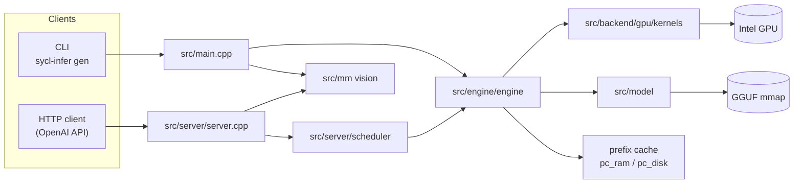
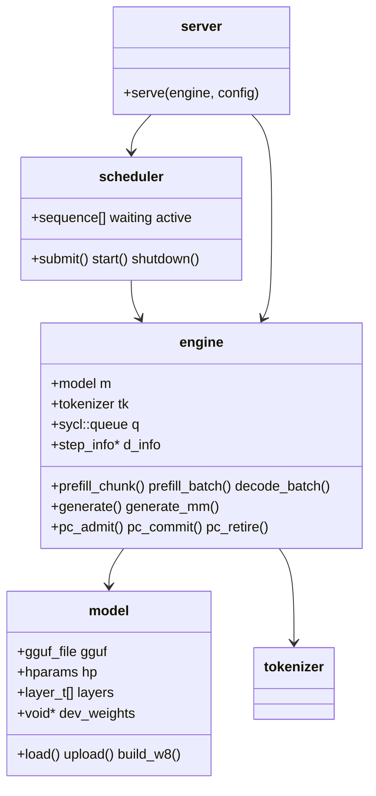
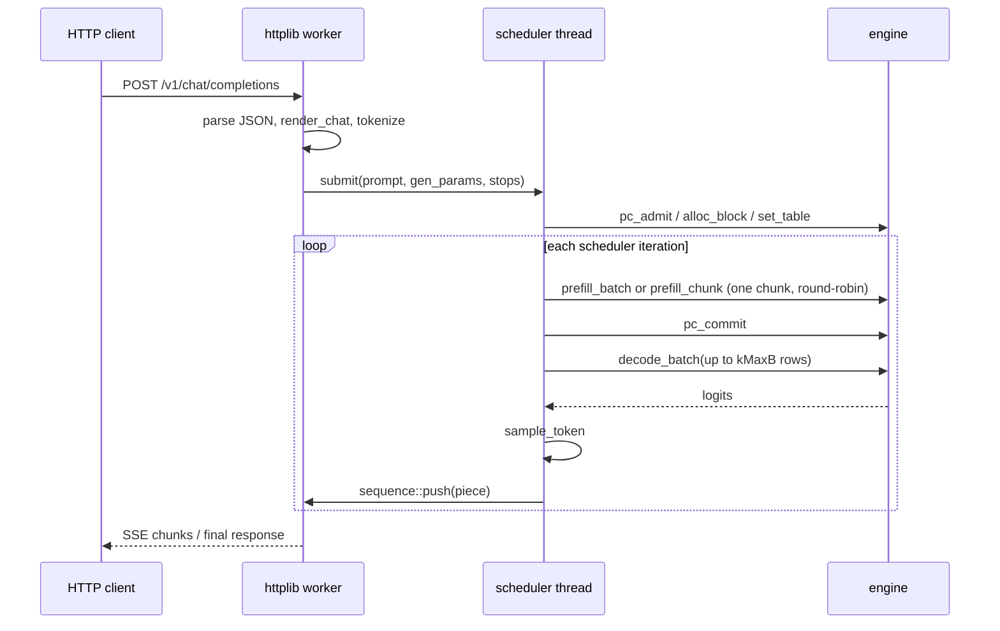

# 总体架构设计

本文描述 `sycl-infer` 的整体架构：系统边界、模块划分、运行时对象模型、请求数据流、线程与设备
内存模型，以及贯穿全项目的设计原则和不变量。各子系统的细节见 `docs/design/`。

---

## 1. 目标与设计原则

`sycl-infer` 是一个从零实现的 C++17 + SYCL 的 LLM 推理引擎，面向 Intel GPU 上的量化 GGUF 模型。
开发与验证的参考模型是 **Qwen3.5-0.8B Q4_K_M**（Intel Iris Xe-LP），但引擎本身不绑定具体模型。

核心设计原则：

1. **架构无关（pluggable architecture）**。模型类型由 GGUF 的 `general.architecture` 决定，通过
   `src/model/model_arch.h` + `model.cpp` 中的注册表分发。新增模型架构 = 新增一个 `.cpp` + 一行注册,
   无需改动引擎或 kernel。见 [design/01-model-loading.md](design/01-model-loading.md)。
2. **量化权重零转换加载**。GGUF 文件以只读 `mmap` 映射，整个映射一次性拷贝到设备，所有设备指针
   都通过“相对 `map_base` 的偏移”从主机指针推导（`model::dev_ptr`）。见
   [design/01-model-loading.md](design/01-model-loading.md)。
3. **kernel 库与编排分离**。每个 kernel 一个编译单元，公开的启动 API 集中在
   `src/backend/gpu/kernels/kernels.h`；共享的设备辅助函数在 `src/backend/gpu/kernels/kernel_utils.h`（`si::kd`）。kernel 体
   不放在头文件里。
4. **图优先执行（graph-first）**。完整的 forward step 按形状一次性录制为 SYCL command graph，之后
   逐步重放，把每 token 的启动开销压到最低。见 [design/04-engine.md](design/04-engine.md)。
5. **所有逐步状态放在 host-USM 的 `step_info` 里，在 kernel 体内读取**。图录制时被主机读取的值会被
   冻结进图，因此任何随 step 变化的值（位置、token id、`n_real`、active 行）都必须在 kernel 内读取。
   这是项目最重要的不变量。
6. **面向集显的带宽优先**。Iris Xe-LP 是内存带宽受限平台，因此：int8 KV 默认；SIn 权重格式按 warp
   合并访问重排；prefill 阻塞批处理让权重保持 L2 热。见 [design/02-quantization.md](design/02-quantization.md)。
7. **设备代码必须持续可用**。GPU（`sycl::gpu_selector_v`）是默认后端；CPU 后端（`src/backend/cpu`，手写
   AVX2 / AVX-VNNI / AVX-512 内核）与 GPU 后端共享同一套 `compute_backend` 接口，可通过
   `--device cpu|gpu|auto` 选择。多设备（层放置）见 §11。

---

## 2. 系统上下文



两个入口共用同一个 `si::engine` 实例：

* **CLI**（`main.cpp`）：`gen` 单序列生成，`serve` 启动 HTTP 服务。多模态走
  `mm_build_prompt_device` + `engine::generate_mm`。
* **HTTP 服务**（`server.cpp`）：OpenAI 兼容 API。文本请求经 `scheduler` 做连续批处理；多模态请求
  绕开调度器，单序列串行执行。

---

## 3. 模块划分

```
src/common/     量化格式与底层公共设施
                quant.h       ggml block 布局 + 主机端反量化参考
                w8.{h,cpp}    SIn int8 权重格式：重排、尺寸、Q6_K scale-only 优化
                dp4a.h        可移植的 dp4a 辅助
                cpu_isa.{h,cpp}  主机 CPU 指令集检测与运行时变体选择

src/backend/    backend.h       compute_backend 抽象（共享接口 + 工厂）
                gpu/gpu_backend.cpp   转发到 SYCL kernel 库
                cpu/cpu_backend.cpp   转换 POD 后调用主机内核
                cpu/cpu_types.h       无 SYCL 的镜像结构 + 启动声明
                dnnl_gemm.{h,cpp}  可选 oneDNN int8 预填充 GEMM（PF_GEMM_DNNL）

src/backend/cpu/kernels/    每个主机 kernel 一个 .cpp（编译时 `-fno-sycl`，可带 AVX2 /
                AVX-VNNI / AVX-512 target attribute；结构类内核为标量）：
                common（线程池 + ISA 分派 + 反量化/RMSNorm 辅助）, rmsnorm,
                embed, copy_row, gemv, qk_norm_rope, attn, conv, gdn,
                gated_norm, xq, dp4a, i8（GGUF 整数 GEMV）

src/backend/gpu/kernels/    kernels.h      公开启动 API + step_info + gemv_seg + 常量
                kernel_utils.h 共享设备辅助（si::kd）：反量化、KV 访问、子组归约等
                kv_type.{h,cpp} KV 存储类型选择与字节几何
                每个 kernel 一个 .cpp：rmsnorm, embed, copy_row, gemv,
                qk_norm_rope, attn, conv, gdn, gated_norm, xq,
                dp4a_gemv, dp4a_gemm（+ dp4a_common 共享 workspace）,
                vit（视觉编码器）

src/model/      gguf.{h,cpp}       GGUF 解析 + mmap
                model.{h,cpp}      通用加载/上传 + 绑定辅助
                model_arch.h       架构注册表接口
                qwen35.cpp         Qwen3.5 混合架构加载器
                model_w8.cpp       SIn int8 权重副本的构建/释放
                tokenizer.{h,cpp}  BPE 分词器

src/mm/         image.{h,cpp}        解码 + Qwen 智能缩放/归一化/patchify
                vision.{h,cpp}       mmproj 加载 + 视觉编码器（host + device）
                multimodal.{h,cpp}   提示词扩展 + M-RoPE 位置

src/engine/     engine.{h,cpp}             编排、缓冲区、单序列 API
                engine_graph.cpp           seg_plan、record_forward、build_graphs
                engine_kvpool.cpp          动态 KV 块池
                engine_prefix_cache.cpp    前缀缓存（VRAM 层 + 三层调度）
                pc_ram.{h,cpp}             主机 RAM 层
                pc_disk.{h,cpp}            磁盘层（记录格式、索引、LRU）
                sampler.{h,cpp}            采样

src/server/     server.{h,cpp}         httplib 服务、JSON、SSE、多模态接入
                scheduler.{h,cpp}      连续批处理调度器
                chat.{h,cpp}           渲染 + 内置 ChatML 回退
                chat_template.{h,cpp}  minja Jinja 封装
                chat_util.h            UTF-8 边界安全的流式缓冲

src/main.cpp    CLI

third_party/    httplib.h, json.hpp, minja/, unicode 表, stb_image.h
```

`src/` 与 `tests/` 是平行结构：每个 kernel / kernel stage 一个文件。

---

## 4. 运行时对象模型



### `si::model`
静态权重：GGUF 的内存映射、解析出的超参数 `hparams`、每层 `layer_t`（张量视图）、整个 GGUF 的
设备副本 `dev_weights`，以及可选的 SIn int8 权重副本。见 [design/01-model-loading.md](design/01-model-loading.md)。

### `si::tokenizer`
从同一个 GGUF 构建的 GPT-2 byte-level BPE 词表，含特殊 token id（`eos`/`eot`/`pad`/`im_start` 等）。
见 [design/08-tokenizer.md](design/08-tokenizer.md)。

### `si::engine`
系统的核心。持有 `sycl::queue`（**in_order**）、所有激活缓冲区、paged KV 池、递归状态、录制好的
command graph、前缀缓存三层。对外提供两类 API：

* **批处理 API**（调度器使用）：`prefill_chunk`、`prefill_batch`、`decode_batch`、`fetch_logits`，
  调用者必须持有 `engine::mtx`。
* **单序列 API**（CLI/测试/多模态）：`eval`、`generate`、`generate_mm`，内部自己加锁。

### `si::server` / `si::scheduler`
HTTP 层与连续批处理层。一个 `engine` + 一个 `scheduler` 线程；httplib 工作线程只做解析/编码和阻塞
等待输出队列。见 [design/09-server.md](design/09-server.md)。

---

## 5. 请求数据流

### 5.1 文本请求（连续批处理路径）



调度器每个外层循环：先给一个 active 序列做一个 prefill chunk（round-robin、公平），再做一次最多
`kMaxB` 行的批量 decode。prefill 与 decode 因此交错执行。细节见 [design/09-server.md](design/09-server.md)。

### 5.2 一次 forward step（引擎内部）

```
embed → for each layer:
    rmsnorm(attn_norm) → [GDN 层: gemv(wqkv/wgate) → conv → gdn → gated_norm → gemv(ssm_out)]
                       [attn 层: gemv(wq/wk/wv) → qk_norm_rope → attn(+combine) → gemv(wo)]
    rmsnorm(post_attn_norm) → gemv(ffn_gate+ffn_up) → gemv(ffn_down)
rmsnorm(output_norm) → [copy_row] → gemv(LM head)
```

该顺序被编码进 `seg_plan`（`engine::build_plan`），`record_forward` 必须严格按同一顺序发射 kernel。
见 [design/04-engine.md](design/04-engine.md)。

---

## 6. 线程与并发模型

| 执行体 | 职责 | 同步 |
|---|---|---|
| httplib 工作线程池 | JSON 解析、chat 渲染、分词、SSE/non-stream 输出 | 每个 `sequence` 自带 mutex+cv |
| 调度器线程（1 个） | 准入、prefill、decode、采样、推送 token | 先 `engine::mtx` 后 `scheduler::m` |
| CLI 主线程 | 单序列生成 | `engine::mtx`（在 `generate` 内部获取） |
| httplib 多模态生产者线程 | `generate_mm` 流式输出 | 全局 `mm_req` mutex + `engine::mtx` |
| 信号 watchdog 线程 | 轮询终止标志，调用 `srv.stop()` | 原子标志 |

* **所有引擎执行由 `engine::mtx` 串行化**。调用 `prefill_*`/`decode_batch` 的代码必须持有该锁。
* 锁顺序固定为 `engine::mtx` → `scheduler::m`，不存在反向路径。
* 多模态请求全程持有 `mm_req`，因为所有请求共享 `engine::d_img_embd`。
* 信号处理器只置原子标志（async-signal-safe）；watchdog 线程每 100 ms 轮询后正常停止服务器，
  从而保证析构时前缀缓存 flush 到磁盘。

---

## 7. 设备内存模型

引擎启动时一次性分配（见 `engine::alloc_buffers` 与 [design/04-engine.md](design/04-engine.md)）：

| 区域 | 说明 |
|---|---|
| `dev_weights` | 整个 GGUF 映射的副本（由 `model::upload` 分配） |
| SIn 权重副本 | `PF_DP4A` 打开时约 700 MB（`model::build_w8`） |
| 激活缓冲 | 行数 `R = kMaxB*kMaxT = 512`，各阶段按需分配 |
| KV 池 | 虚拟 USM 预留 + 物理 extent 按需提交（`engine_kvpool.cpp`） |
| 递归状态 | `d_gdn_state`、`d_conv_state`，每序列一个 slot |
| 前缀缓存检查点 | `d_pc_states[pc_max_states][pc_state_floats]` |
| command graph | 每个形状一份可执行图（decode 桶 1/2/4/8/16、prefill 变体） |

KV 池的地址范围只预留一次，物理内存按 extent 提交/解映射，这样录制进图的每层基址指针在池增长时
仍然有效。见 [design/05-kv-cache.md](design/05-kv-cache.md)。

---

## 8. 关键常量

| 常量 | 值 | 含义 |
|---|---|---|
| `kMaxT` | 32 | 每行最大 prefill token 数 |
| `kMaxB` | 16 | 最大并发序列数 |
| `kMaxRows` | 32 | 每 token 缓冲的最大行数 |
| `kBlockSize` | 32 | paged KV 块大小（token） |
| `kI8Q` | 32 | int8/int4 KV 每多少 head dim 一个 scale |
| `kMaxSplits` | 64 | prefill attention K-split 容量 |
| `kMaxDecSplits` | 256 | decode K-split 容量 |
| `kPcMapLen` | 1024 | 前缀缓存检查点边界映射长度（覆盖 32768 token） |
| `kMaxImgTokens` | 1024 | 单图最大合并视觉 token 数 |
| `kMaxImgPatches` | 4096 | 单图最大 ViT patch token 数（= 4 × 合并 token） |

定义在 `src/backend/gpu/kernels/kernels.h`。修改这些常量会改变设备内存占用，也会改变录制图的形状集合。

---

## 9. 全局不变量

1. **图冻结主机读取值**。`record_forward` 期间主机读到的值会被烘焙进 command graph。逐步状态必须
   存放在 host-USM 的 `step_info` 中并在 kernel 体内读取。见 [design/04-engine.md](design/04-engine.md)。
2. **`record_forward` 与 `build_plan` 的调用顺序必须同步**。plan 编码每个 call 的边界，forward 必须按
   相同顺序消费；末端 LM head 是最后一个 call。
3. **oneDNN 不能录制进 SYCL 图**。`PF_GEMM_DNNL` 路径直接重放模式 2（`prefill_batch`）。
4. **不要多个 TU 包含 `sycl/ext/oneapi/dot_product.hpp`**（其函数在该工具链下不是 `inline`），统一用
   `src/common/dp4a.h`。
5. **int8/int4 KV 布局**是 `[block][kv head][token][head_dim]`（i4 为 `head_dim/2` 个打包字节）数据 +
   独立的 fp16 scale 平面；池与 scale 都按字节推进（`kv_layer_stride`、`kv_scale_stride`）。
6. **多模态下 KV slot 序号与 RoPE 位置分离**：图像消耗 `max(nx,ny)` 个位置却有 `4*nx*ny` 个 token，
   decode 时 `info->pos` 是 token 计数，RoPE 位置由 `step_info::mrope` 携带（`mrope_on`）。
7. **图像 token 不经过 `tok_embd`**：embed kernel 直接拷贝 `step_info::img_embd[img_row[t]]`。
8. **多模态路径绕过前缀缓存**，使用单序列 `engine::generate_mm`。

---

## 10. 扩展点

* **新增模型架构**：[design/01-model-loading.md](design/01-model-loading.md)。
* **新增 kernel**：[design/03-kernels.md](design/03-kernels.md)。
* **新增 kernel stage 测试**：[design/12-build-and-testing.md](design/12-build-and-testing.md)。
* **新增服务端点**：[design/09-server.md](design/09-server.md)。
* **前缀缓存策略**：[design/06-prefix-cache.md](design/06-prefix-cache.md)。

任何改动都应遵守 [AGENTS.md](../AGENTS.md) 的“Quick verification”流程：构建无警告、
`test_gpu_stages` / `test_gpu_vs_ref` / `test_forward` 通过、`clang-tidy` include-cleaner 干净。

---

## 11. 设备选择与多设备执行

### 11.1 后端抽象

`src/backend/backend.h` 的 `compute_backend` 是 `src/backend/gpu/kernels/kernels.h` 启动 API 的一一镜像
（RMSNorm / embed / GEMV / paged attention / conv / GDN / gated_norm / xq / dp4a）。引擎的
`record_forward` 只调用 `compute_backend`，因此同一份前向逻辑可以：

* `gpu_backend`：把调用直接转发给 SYCL kernel；`record_forward` 在 command graph 录制期间调用它。
* `cpu_backend`：把 `step_info` / `gemv_seg` 转换成无 SYCL 的镜像 POD，再调用 `src/backend/cpu` 的主机内核。

`src/backend/cpu/kernels/` 用 `-fno-sycl` 单独编译，因此可以安全地使用 `<immintrin.h>` 与
`__attribute__((target(...)))`，且不进入 SYCL device pass。热点循环按 `src/common/cpu_isa.h`
在运行期选择 AVX2 / AVX-VNNI / AVX-512（int8 点积用 VNNI 的 `dpbusd`，否则 AVX2
`maddubs+madd`；fp32 归约/点积同理）。`PF_CPU_ISA=scalar|avx2|avx512|avxvnni` 可强制变体；
CPU worker 线程数由 `--cpu-threads N` 或 `PF_CPU_THREADS` 指定（默认 = 物理核数，探测失败时回退到硬件并发）。

CPU 后端默认跑 **从 GGUF block 直接提取的整数 int8 GEMV**（`kernels/i8.cpp`，
Q4_K/Q5_K/Q6_K；Q8_0 与未知格式回退到 `common.cpp` 的融合 fp32 `qgemv_sb_*`），
激活由 `cpu_xq` 量化；不需要也不构建 GPU 用的 SIn w8 副本（约 700 MB）。`PF_DP4A=0`
强制融合 fp32 路径。不使用 oneDNN、不使用虚拟 USM，KV 池是普通主机 USM
（`engine::kv_setup` 的 `cpu_mode` 分支），所有引擎 scratch 用 `sycl::malloc_host` 分配。
由于没有 command graph，`prefill_chunk` / `decode_batch` 直接调用 `record_forward`
（与 `PF_NOGRAPH` 相同的直放路径）。

### 11.2 多设备层放置（pipeline parallel）

`--layer-map 0-11:gpu,12-23:cpu` 把层区间映射到设备（`gpu` / `cpu`），每个区间是闭区间且必须无
缝隙地覆盖 `[0, n_layer)`。**多设备之间采用 pipeline parallel（层区间流水）**：设备 `d` 计算自己的
层区间 `[l0,l1)`，算完后把隐藏状态 `d_x` 交给下一个设备，后者接着算下一段；当前每次只推进一个
micro-batch（单序列/单批），不做跨设备重叠。具体地：

* `backends_` 每个设备一个后端；`layer_dev_[il]` 决定每层用哪个后端，`record_forward` 在层边界
  同步上一个设备（`backends_[d]->synchronize()`），保证对共享主机 USM 激活的写可见——这就是
  pipeline 的 stage 交接点。激活缓冲区走主机 USM，所以交接不需要显式的 D2D/H2D 拷贝。
* GPU 后端各自持有整份权重副本（`weight_blobs_`），CPU 后端直接读 mmap；`wptr(dev, host)` 为
  每层的权重张量解析出该设备的指针，`build_plan` 因此能生成一份含正确指针的计划。
* **KV 按设备分开**：`layer_attn_local_[il]` 给出该层在所属设备注意力层中的序号，`dev_kpool_[d]`
  只包含该设备的注意力层。block id 是全局的（同一张 block table），所以 paged attention 与
  `set_table` 无需改动。
* 多设备路径直接重放计划（无图）、激活走主机 USM，因此不支持前缀缓存（三层 KV 缓存需要多池
  记录）；`pf8` 与 oneDNN 也在多设备下关闭。

这满足“dense 模型跨设备流水”的需求：混合模型（GDN + attention）同样可用，因为递归状态也在共享
主机 USM 中按全局 GDN 层序号索引。

