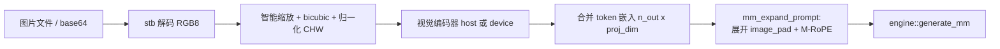

# 设计 10：多模态（视觉）输入

覆盖 `src/mm/image.{h,cpp}`、`vision.{h,cpp}`、`multimodal.{h,cpp}`、`src/backend/gpu/kernels/vit.cpp` 以及引擎侧的
`generate_mm` / `step_info` 多模态字段。音频与视频见 [13-audio-video.md](13-audio-video.md)。

---

## 1. 概览

Qwen3.5 的视觉输入由独立的 **mmproj GGUF**（`clip` 架构）提供。流程：



两条前向路径（`vision_model::encode_host` / `encode_device`）互为参考：host 版是标量参考实现，device 版
逐阶段镜像它。它们**共享几何与 token 顺序契约**，但不共享输入构造函数——host 路径用
`build_patch_input`（patch 投影在主机上算完，`vision.cpp:339-397`），device 路径用
`build_raw_patches` + `build_pos_emb` 把两件事都留给设备上的 GEMM
（`vision.cpp:274-337`）。一致性要求：实测约 2e-4，测试阈值 5e-3·max(1, max|host|)
（`test_multimodal.cpp` 的视频抽帧检查）。

---

## 2. 图像预处理（`image.cpp`）

### 2.1 数据模型

```cpp
struct mm_image { int width; int height; std::vector<float> chw; };   // image.h:19-23
struct image_preproc_cfg {                                            // image.h:25-32
    int patch_size = 16, merge = 2;
    int min_pixels = 0, max_pixels = 0;   // 0 = 关闭
    float mean[3] = {0.5,0.5,0.5}, std[3] = {0.5,0.5,0.5};
};
```

`chw` 是 plane-major（CHW）fp32，三个连续平面 R/G/B，已归一化。运行时配置由 mmproj 超参覆盖：三个调用点
（CLI `main.cpp` 的 `ensure_vm()`、服务端 `serve()` 的 mm 加载、视频路径的 `vision_cfg`，`multimodal.cpp:210` 的 `vision_cfg`）
都从 `vm.hp` 派生同一份 cfg，公式见 §2.6。

### 2.2 解码

stb 在本 TU 编译（`STB_IMAGE_IMPLEMENTATION` + `STBI_ONLY_JPEG/PNG/BMP/GIF` + `STBI_NO_STDIO`，
`image.cpp:7-12`）。`mm_image_decode_mem` 调 `stbi_load_from_memory(..., 3)` 强制 RGB8
（`image.cpp:181`）；`mm_image_decode_file` 自己 `fopen`/`fread` 整个文件再委托之，不把路径交给 stb
（`image.cpp:193-221`）——`STBI_NO_STDIO` 决定了这一点。

### 2.3 Qwen 智能缩放（`mm_image_target_size`，`image.cpp:123-147`）

对齐单元 `align = patch_size * merge`（Qwen3.5 为 32）。

```
w_bar = max(align, round_by_align(w));  h_bar = max(align, round_by_align(h))
if max_pixels > 0 && h_bar*w_bar > max_pixels:
    beta = sqrt((w*h) / max_pixels)
    h_bar = max(align, floor_by_align(h/beta)); w_bar = max(align, floor_by_align(w/beta))
else if min_pixels > 0 && h_bar*w_bar < min_pixels:
    beta = sqrt(min_pixels / (w*h))
    h_bar = ceil_by_align(h*beta); w_bar = ceil_by_align(w*beta)
```

* 三个 `*_by` lambda 都以 `align` 为粒度（`image.cpp:130-132`）。
* 两边永远对齐到 `patch_size*merge` 的倍数，保证合并网格精确（`make_input` 用的是整数除法
  `pw/merge`，`vision.cpp:268-269`）。
* max 分支优先（`else if`），因此 `max_pixels` 压过 `min_pixels`。
* min 分支放大小图（`ceil`，且**不带** `max(align,…)` 下界），max 分支缩小大图（`floor`，带下界）。

### 2.4 Pillow 兼容 bicubic 重采样

`resize_bicubic`（`image.cpp:50-119`）是可分离两趟重采样。核是 Pillow 的 bicubic（`a=-0.5`），
`image.cpp:19-20` 的注释强调 ggml/PyTorch 用 `a=-0.75`，这里**有意对齐 Pillow**，因为 llama.cpp 的参考
预处理也用 Pillow。

每轴：`scale = src/dst`、`filterscale = max(1, scale)`、`support = 2*filterscale`、
`center = (x+0.5)*scale`，tap 范围 `[center-support+0.5, center+support+0.5)` 裁剪到源尺寸，权重
`filter_w((i-center+0.5)/filterscale)`。水平趟（`image.cpp:53-82`）每个输出像素重建 tap 并存 float
中间结果，按权重和 `ww` 归一化；垂直趟（`image.cpp:87-117`）预计算 tap 权重、按 `wsum` 归一化，输出经
`clip8`（`lround` + `[0,255]` clamp，`image.cpp:39-47`）。

### 2.5 归一化（patchify 在视觉塔侧）

`mm_image_preprocess`（`image.cpp:149-176`）：算目标尺寸，仅当尺寸变化才重采样（`image.cpp:159-163`），
然后 plane-major 写出

```
v = src[p*3+c] / 255.0f;
chw[c*n + p] = (v - mean[c]) / std[c];
```

patchify 不在这里——它属于视觉塔的输入构建（`build_raw_patches` / `build_patch_input`），见 §3.4。

### 2.6 预算常量

`kMaxImgTokens = 1024`（单图最大合并 token）、`kMaxImgPatches = 4*kMaxImgTokens = 4096`（patch token），
定义在 `src/backend/gpu/kernels/kernels.h:28-33`。前者约束三处：`d_img_embd` 的行数
（`engine.cpp:1705` 分配 `kMaxImgTokens * n_embd`）、`image_preproc_cfg::max_pixels`
（`= kMaxImgTokens * patch_area`，其中 `patch_area = P²·merge²`，见 `main.cpp:519-521`、服务端 `serve()` 的 `max_pixels`、
`multimodal.cpp` 的 `vision_cfg`），以及 prompt 装配时的总行数检查（`multimodal.cpp:164-165` 等）。
后者约束每图的 patch 网格与设备 scratch（`vision.cpp:559-562` 抛错）。因为 `max_pixels` 已经把合并
token 数封在 `kMaxImgTokens` 以内，图像路径上这两个上限实际是同一个约束的两种表述。

---

## 3. 视觉编码器

### 3.1 类型

* `vt`（`vision.h:26-31`）：行主序权重视图 `{data, type, K, N}`（`K = dims[0]`，`N = n_rows()`）。
* `vision_hparams`（`vision.h:33-48`）：`image_size, patch_size, n_embd, n_ff, n_layer, n_head, head_dim,
  proj_dim, merge, n_pos_side, eps, rope_base, mean/std[3]`。`head_dim` 是**派生**的
  `n_embd / n_head`（`vision.cpp` 加载处派生，不是元数据字段）。
* **「能加载」不等于「能跑」，所以这个区别是可查询的**：`vision_model::runnable()`
  报告加载器是否会接受这个几何（`head_dim` 是否被支持、`proj_dim` 是否匹配文本宽度），
  而前向自己也会查一遍。远端的 mmproj 文件全是 `head_dim 72`（编码器只实现 64）或
  `proj_dim` 不匹配——在 `runnable()` 之前，这些文件能加载成功、23 项检查全部通过，
  然后在第一次前向时 abort。**新增几何约束时要同时加到 `runnable()` 和前向的检查里**，
  否则这个区别是不可见的；调用方应当用 `runnable()` 把「能加载但不能跑」报出来，
  而不是让它变成一次运行时中止。
* `vision_layer`（`vision.h:50-61`）：`qkv/out/up/down` + 可选 f32 bias，`ln1/ln1_b, ln2/ln2_b`。
* `vision_input`（`vision.h:64-74`）：`chw`、`width/height`、`pw=w/P`、`ph=h/P`、`n_patches=pw*ph`、
  `out_w=pw/merge`、`out_h=ph/merge`、`n_out=out_w*out_h`；由
  `vision_model::make_input` 填写（`vision.cpp:260-272`）。
* `vision_model`（`vision.h:76-127`）：权重 + 设备状态；`patch_w` 是两个 patch conv 相加后反量化的 f32
  `[n_embd][3*P²]`；`pos_embd_host` 是反量化的 learned position；`dev_weights` 是整块 GGUF 的设备副本；
  `d_patch_w` 与 8 个 scratch 缓冲是模型自有的设备内存。所有权：`dev_q` pin 住首次传入的
  engine queue（换 queue 直接抛，跨 queue 释放是 UB），析构按成员表全释放
  （`free_dev_ptrs`，`enc_common.h`；audio 塔同构）。模型禁拷贝，只传引用。

### 3.2 mmproj 加载

元数据来自 `clip.vision.*`（`vision.cpp:144-164`）：`image_size`、`patch_size`、`embedding_length`、
`feed_forward_length`、`block_count`、`attention.head_count`、`projection_dim`、
`spatial_merge_size`（默认 2）、`attention.layer_norm_epsilon`（默认 1e-6）、`rope_theta`（默认 10000）、
`image_mean/std`。张量：

* `v.patch_embd.weight` + `v.patch_embd.weight.1`：两个 4-D 卷积 `[kw,kh,in,out]`，校验
  `N=n_embd`、`K=3P²`，**逐元素相加**后反量化为 `patch_w`（`vision.cpp:187-201`，注释解释了
  “参考实现对同一输入做两个 conv 求和”）；`v.patch_embd.bias` 可选。
* `v.position_embd.weight`：要求行数是正方形（`n_side=round(sqrt(N))`，否则抛
  `position embedding not square`），逐元素反量化为 f32 `[N][K]`（`vision.cpp:205-217`）。注意**没有
  转置**：GGUF 张量本身按 `[pos][embd]` 行主序存放（`vt_get` 取 `data[s*K+d]`）。
* `v.post_ln.weight/bias`。
* 每层 `v.blk.{i}.`：`attn_qkv.{weight,bias}`、`attn_out.{weight,bias}`、
  `ffn_up.{weight,bias}`、`ffn_down.{weight,bias}`、`ln1.{weight,bias}`、`ln2.{weight,bias}`。
* `mm.0.{weight,bias}`、`mm.2.{weight,bias}`。

约定：**线性层/嵌入为 BF16（也接受 F16/F32），norm/bias/patch/position 为 F32**（随附的 mmproj 即如此）；
`bind_f32_opt`（`vision.cpp:27-36`）对 norm/bias 强制 F32，类型不符即抛错，缺失返回 nullptr（bias 可选）。

### 3.3 上传与指针翻译

`upload`（`vision.cpp:251-258`）把整个 mmproj 映射（`gguf.map_size`）一次性拷到设备；
`dev_ptr`（`vision.h` 的 `dev_ptr`）用与文本模型相同的偏移恒等映射
（`(char*)dev_weights + ((char*)host_ptr - (char*)gguf.map_base)`）。`patch_w` 是加载时合成的数据，不在
映射内，因此单独分配设备副本 `d_patch_w`（`vision.cpp:570-576`，只拷一次）。析构有意不释放
`dev_weights`（`vision.cpp:245-249` 的空实现带注释说明：分配它的队列已随模型生命周期结束）。

### 3.4 host 参考前向（`encode_host`）

* **输入构建**：`build_patch_input` 按合并 token 顺序，每 token 抽 `[c][kh][kw]` 顺序的 patch，用
  `patch_w`（+bias）投影，再加位置嵌入（`pw==ph==n_side` 时精确取样，否则 `pos_sample` 的 align_corners
  双线性，`vision.cpp:109-125`）。位置嵌入用**同一个 reorder 的原始 patch 坐标** `(py,px)` 取样
  （`vision.cpp:376-390` 的注释）。
* **合并顺序**：`my, mx, dy, dx` 四层循环（`vision.cpp:351-355`），因此每个 2×2 合并组内 token 连续，
  合并输出行是 4 个组 token 的拼接。这是整个合并阶段依赖的顺序契约，`vit_rope` 的坐标反推
  （`vit.cpp:299-305`）也依赖它。
* **Transformer 层**：LayerNorm（double 求均值/方差，`vision.cpp:45-62`）→ fused QKV → 2D RoPE（见
  §3.7）→ 双向 attention（无因果掩码，`1/sqrt(HD)`）→ out 投影 + residual → ln2 →
  `up → gelu_tanh → down` + residual。token → patch 坐标的反推在 `vision.cpp:428-434`。
* **merger**：`C = merge² = 4`，`hidden = C*n_embd`；`n_out` 行直接重解释为 `n_out` 个长度 `hidden`
  的向量（2×2 拼接是 stride 重解释，`vision.cpp:523-529`），然后 `mm.0 → gelu → mm.2`，输出
  `n_out * proj_dim`。文本引擎按 `n_embd` 为每行分配，所以 CLI/服务器加载 mmproj 时，
  以及 `mm_build_prompt*` 编码前，均校验 `proj_dim == text n_embd`；不匹配直接报错，
  不能把 `proj_dim` 个 float 写进 `n_embd` 行跨度。

### 3.5 device 前向（`encode_device`）

守卫（`vision.cpp:556-565`）：非空网格、`np <= kMaxImgPatches`、`HD == 64`（`vit_attn` 的
`constexpr int HD = 64`，`vit.cpp:335-338`）。

迟初始化：首次调用时 `upload(q)`；`d_patch_w` 一次性拷贝；scratch 在 `np` 变大时整体重分配（8 个缓冲），
`scratch_patches` 记录上次尺寸，因此后续更小的图复用 —— 即“增长到见过的最大图”（`vision_model::encode_device` 的 scratch 增长判断，`vision.cpp`）。
缓冲：`d_patch_in = np*3P²`、`d_pos = np*E`、`d_x/d_ln/d_attn = np*E`、`d_qkv = np*3E`、
`d_ffn = np*ff`、`d_mm0 = n_out*hidden`。

流水线（`vision_model::encode_device`，`vision.cpp`）：host 构建 raw patch + pos → 两次 memcpy → patch 投影 GEMM
（`N=E, K=patch_elems, T=np`）→ +bias → += pos → 每层（ln1 → qkv GEMM → +bias → RoPE → attn →
`x += out_b` → out GEMM 带 residual → ln2 → up GEMM → +bias → GELU → `x += down_b` → down GEMM 带
residual）→ post LN → merger（`mm.0` GEMM 的 `K=hidden`、`x_stride=hidden` 即 2×2 拼接重解释 →
bias → GELU → `mm.2` → bias）→ `q.wait()`。

两个值得记的实现细节：

* **残差通过 GEMM 的 `residual` 参数完成**：`vit_gemm_launch` 的最后一个参数非空时输出为
  `alpha*acc + residual[t][n]`（`vit.cpp:178-190`），所以 `out`/`down` 两个投影直接写回 `d_x`。
* **两条路径的 RoPE 基数同源**：都用 `hp.rope_base`（即 mmproj 的 `clip.vision.rope_theta`，默认
  10000）——host 是 `pow(rope_base, -2/(HD/2))`（`vision.cpp:411-415`），device 把它交给
  `vit_rope_launch`（`vision_model::encode_device` 里的 `vit_rope_launch`，`vit.cpp:294` 再取 `log2(rope_base)`）。host 路径原先硬编码
  10000，于是换一个 `rope_theta` 的 mmproj 会让参考与 GPU 分叉，已修。

**队列必须 in-order**：各阶段数据依赖但启动器不发事件（没有 `ext_oneapi_submit_barrier`），因此要求
in-order 队列（引擎队列即是）。测试也显式建 in-order 队列（`test_multimodal.cpp` 里建 in-order 队列处）。

### 3.6 视觉 kernel

全部在 `src/backend/gpu/kernels/vit.cpp`，激活一律 fp32，权重 BF16 或 F32（行主序 `[N][K]`）：

| kernel | 启动几何 | 说明 |
|---|---|---|
| `vit_gemm_launch` | 128 线程 WG，覆盖 64 行 × 32 token 的 tile（`vit.cpp:69-84`）；每 lane 拥有 `TP=4` token × `RP=4` 行，K 按 64 一块进 SLM | `out[t][n] = alpha*Σ W[n][k]x[t][k] (+residual)`；BF16/F32 两个模板实例 |
| `vit_layernorm_launch` | 256 线程 WG，每 WG 8 行（每行一个 32-lane 子组，`vit.cpp:216-218`） | 通道内规约用 `sg_sum` |
| `vit_gelu_launch` | 一线程一个元素（`vit.cpp:245-254`） | tanh 近似，`sqrt(2/pi)` 硬编码 |
| `vit_add_bias_launch` / `vit_add_launch` / `vit_copy_launch` | `range<2>(rows, cols)` | 三种逐元素偏置/加法/拷贝 |
| `vit_rope_launch` | `range<1>(n_tok*n_head*head_dim/2)` | 2D 视觉 RoPE，见 §3.7 |
| `vit_attn_launch` | 每 `(head, 32-query block)` 一个 128 线程 WG，K/V tile 64 行过 SLM | 双向注意力，**在线 softmax**（running max/sum），score 矩阵不出工作组 |

在线 softmax 是必要的：token 数上界是 `kMaxImgPatches`，`n_tok × n_tok` 的 score 矩阵不能显式物化
（`vit.cpp:5-7` 的文件头注释）。FFN 的 `up`/`down` GEMM 与 merger 的 `mm.0`/`mm.2` 都走同一个
`vit_gemm_launch`。

### 3.7 视觉 RoPE vs 文本 M-RoPE（最容易混淆处）

这两个 RoPE 完全独立，**不要混为一谈**：

| | 视觉塔自己的 RoPE（`vit_rope`） | 文本模型的 M-RoPE（`qk_norm_rope`） |
|---|---|---|
| 位置来源 | 由合并 token 序号反推 patch 网格坐标 `(py,px)`（`vit.cpp:299-305`） | `step_info::mrope[sec*(kMaxB*kMaxT) + r*kMaxT + t]`，值由 `mm_expand_prompt` 装配（§4.3） |
| 分段方式 | `head_dim` 切 4 段、每段 `head_dim/4` 对：`sec = pair/(head_dim/4)`（`vit.cpp:306-307`） | 交错 sector 模式：`sector = lane % (s0+s1+s2+s3)`，再按 `sector%3` 取 row（且 `sector < 3*s1`）/ col（`sector < 3*s2`）/ temporal（`sector < 3*s0`）；三个条件都不满足就落到默认的 `sec = 3`（`qk_norm_rope.cpp:56-64`） |
| 哪段用哪个位置 | **`sec == 0` 用 patch 行 `py`，其余段用 patch 列 `px`**（`vit.cpp:308`；host 侧同样，`vision.cpp:445`）。HD=64 时每头只有 32 对，段 2/3 不存在 | 三个 section 的位置全部来自 mrope 数组，按上面的 sector 规则选 |
| 频率指数 | **每段重置**：`p = pair % (head_dim/4)`，`theta = pos * base^(-2p/(HD/2))`（`vit.cpp:309`；host 侧 `vision.cpp:443-446` 的注释写明 “sections {16,16,16,16}, exponent resets”） | **全局 pair 索引**：`theta = rpos * base^(-2*lane/n_rot)`，`lane` 就是全局 pair 序号（`qk_norm_rope.cpp:82`） |

段宽来自 GGUF 的 `rope.dimension_sections`（读入 `hp.rope_sections`，`qwen35.cpp:39-43`），Qwen3.5 参考
架构是 `[11,11,10,0]`（即 `sector = lane % 32`）。四段全 0 表示普通 RoPE（`model.h:30-31`）；此时
`sect_dims == 0` → `sector = lane`、`sec` 落到默认的 3，而 mrope 的第 4 段是 temporal 的副本
（`multimodal.cpp:128`），所以带图的提示词依然退化为正确行为。

---

## 4. 提示词组装（`multimodal.cpp`）

### 4.1 `mm_prompt`（`multimodal.h:52-63`）

```cpp
struct mm_prompt {
    std::vector<int> tokens;        // 展开后的 token id
    std::vector<int32_t> mrope;     // 4*n，section-major（[s*n+i]）
    std::vector<int32_t> img_row;   // n，-1 或嵌入表行号
    std::vector<float> embd;        // host 路径：n_img_total * n_embd
    const float * d_embd;           // device 路径：调用者拥有
    int n_img, pos_after;
    bool has_images() const { return n_img > 0; }
};
```

`n_img` 就是 block 数（三种媒体都算），`engine::generate_mm` 用 `has_images()` 决定是否走多模态分支
（`engine.cpp:2354-2358`）。

### 4.2 块几何与预算

每张图由 `vision_model::make_input` 出一个 `vision_input`；`n_out <= 0` 抛
`image too small for the patch grid`。接着填一个 `mm_block`（`multimodal.h:42-50`）：

```
pad_tok = <|image_pad|> 的 id
kind    = MM_KIND_IMAGE
out_w/out_h = 合并网格
n_tok   = n_out
n_pos   = max(out_w, out_h)          // 图像消耗 max(nx,ny) 个位置
```

`off[k]`（第 k 个块的嵌入起始行）是按 `n_tok` 累加得到的，总行数 `> kMaxImgTokens` 即抛
`image tokens exceed the kMaxImgTokens budget`。四个入口各自做一遍这段规划：
`build_image_prompt`（`multimodal.cpp` 的 `mm_plan_images`）、`mm_build_prompt_device`（`multimodal.cpp` 的 `mm_build_prompt_device`）、
`plan_videos`（`multimodal.cpp:241-279`）、`mm_build_prompt_mixed_device` 的规划趟
（`mm_build_prompt_mixed_device`，`multimodal.cpp`）。

### 4.3 token 扩展与 M-RoPE（`mm_expand_prompt`，`multimodal.cpp:40-132`）

所有七个入口的扩展都走这一个函数——这也是“host 与 device 返回相同 token/position 布局”的机制保证：
两边只在 `blocks` 的构造上分叉，扩展与位置计算完全共用。

* pad token id 查表 `kPadName[3] = {"<|image_pad|>", "<|video_pad|>", "<|audio_pad|>"}`
  （`multimodal.cpp:19`）；tokenizer 里没有就抛 `mm: tokenizer has no <…> token`
  （`multimodal.cpp:21-27`）。
* 按 `parse_special=true` 分词 `rendered`（`multimodal.cpp:48`），统计每种 pad 的出现次数，要求与
  `blocks` 里同 pad 的块数一致，否则抛 `placeholder count does not match block count`
  （`multimodal.cpp:55-59`）；块按 pad 在 `rendered` 中出现的顺序被消费。
* 预算的第二次检查：`Σ n_tok` 必须等于调用者传入的 `total_rows`（`multimodal.cpp:70-72`）。
* 对每个 pad（`nx = out_w`，`base = 当前 pos`，`gwh = out_w*out_h`），`multimodal.cpp:90-108`：

  | kind | 每 token 的 `(t, h, w)` | 块消耗的位置 |
  |---|---|---|
  | `MM_KIND_IMAGE` | `(base, base + i/nx, base + i%nx)` —— 所有 token 共享 temporal | `n_pos = max(out_w, out_h)` |
  | `MM_KIND_VIDEO` | `(base + i/gwh, base + (i%gwh)/out_w, base + (i%gwh)%out_w)` | `n_pos = max(out_w, out_h)` |
  | `MM_KIND_AUDIO` | `(base + i, 0, 0)` —— TM-RoPE，纯时间流 | `n_pos = n_tok` |

  即**图像消耗 `max(nx,ny)` 个位置，而不是每 token 一个**：这是图像路径最容易被搞错的地方。
  循环结束后 `pos = base + b.n_pos`（`multimodal.cpp:108`）。
* 文本 token 每 token 进一个位置，`t,h,w` 三段都等于 `pos`（`multimodal.cpp:112-115`）。
* `img_row` 在块内填 `off[bi] + i`，块外填 `-1`（`multimodal.cpp:92` / `111`）。
* mrope 按 section-major 写：section 0/1/2 = temporal/row/col，section 3 = temporal 的副本（第 4 段
  0 对，不参与旋转，`multimodal.cpp:124-129`）。
* 收尾检查所有块都被消费（`multimodal.cpp:118-120`），`pos_after = pos`。

### 4.4 入口

| 入口 | 位置 | 说明 |
|---|---|---|
| `mm_build_prompt` | `multimodal.cpp:173-176` | host：规划 → `mm_expand_prompt` → 分配 `embd` → 逐图 `encode_host` 拷到 `offset[k]*n_embd` |
| `mm_build_prompt_device` | `multimodal.cpp` 的 `mm_build_prompt_device` | 规划 → 逐图 `encode_device` 写 `d_out + offset[k]*n_embd` → `mm_expand_prompt` → `p.d_embd = d_out` |
| `mm_build_prompt_video` / `..._device` | `multimodal.cpp:283-316` | 见 [13-audio-video.md §2](13-audio-video.md) |
| `mm_build_prompt_audio` / `..._device` | `multimodal.cpp` 的 `mm_build_prompt_audio` | 见 [13-audio-video.md §3](13-audio-video.md) |
| `mm_build_prompt_mixed_device` | `mm_build_prompt_mixed_device` | 混合装配，见 [13-audio-video.md §4](13-audio-video.md) |

`vm` 必须活到调用返回之后（device 路径的 `encode_device` 在调用内完成，但 `p.d_embd` 指向调用者的
`d_out`）；`d_out` 由调用者拥有（引擎传 `e.d_img_embd`）。

---

## 5. 引擎集成

* `d_img_embd`：`kMaxImgTokens * n_embd` f32，启动时分配一次（`engine.cpp:1705`，
  `engine.h:218`）。host 路径（`mm->embd` 非空且 `d_embd` 为空）会在 `generate_impl` 开头拷进去
  （`engine.cpp:2387-2389`）；device 路径本来就是它。
* `step_info` 多模态字段（`kernels.h:109-118`）：`mrope_on`、`mrope_sections[4]`、
  `mrope[4*kMaxB*kMaxT]`（section-major）、`img_embd`、`img_row[kMaxB*kMaxT]`。它们全部在
  **kernel 体内**读取，所以 prefill 走的记录命令图（`prefill_chunk` 提交 `e_pf8`/`e_pf`，
  `engine.cpp:2039`）每一步都能拿到当前值。
* `mrope_sections` 在 `reset_state` 里从 `hp.rope_sections` 恢复（`engine.cpp:1958-1960`）。
* **prefill 走 mode-1 分块**：多模态分支按 `kMaxT` 逐块调用 `prefill_chunk` 并逐块刷新
  `mrope`/`img_row`（`engine.cpp:2403-2419`），**不走** `prefill_text` 的 mode-2 批量 prefill。结构性原因：
  `step_info::mrope` / `img_row` 是定长 `4*kMaxB*kMaxT` / `kMaxB*kMaxT`（`kernels.h:116-118`），
  一个图像块可以连续占掉多行，放不进 mode-2 的多行布局。
* **embed kernel**：`img_embd && img_row[t] >= 0` 时直接拷贝对应行，图像 token 不经过 `tok_embd`
  （`embed.cpp:30-36`；CPU 后端同逻辑，`src/backend/cpu/kernels/embed.cpp:12-16`）。
* **qk_norm_rope kernel**：`mrope_on` 时按交错 sector 模式从 `mrope` 选 `rpos`（`qk_norm_rope.cpp:49-66`
  在 Q/K 分支之前算一次，Q 用 `:82`、K 用 `:103`）；频率指数仍是全局 pair 索引。CPU 侧对应
  `src/backend/cpu/kernels/common.h:115-122` 的 `mrope_section`。
* **decode 阶段**：KV slot 序号是 **token 计数**（`pos_buf[0] = pos`），RoPE 位置单独在
  `next_pos` 里携带（初值 `mm->pos_after`，`engine.cpp:2430-2435`），每步把 4 段都写成 `next_pos` 并置
  `mrope_on`（`engine.cpp:2484-2490`），然后 `next_pos++`。二者因图像而分离——一张图用
  `max(nx,ny)` 个位置换 `4*nx*ny` 个 token，这个分叉是必须的。prefill 结束后 `img_embd` 被置回
  `nullptr`（`engine.cpp:2435`），避免 decode 步误抄。
* **绕过的东西**：
  * *前缀缓存*：`generate_impl` 从不调 `pc_admit`/`pc_commit`，且 `reset_single()` → `reset_state()`
    会清空 `pc_slot_[].tracking`（`engine.cpp:1961-1965`），于是 `prefill_chunk` 里的
    `pc_capture_begin` 在 `!ps.tracking` 处直接返回（`engine_prefix_cache.cpp:797-800`），既不匹配也不
    快照。
  * *MTP*：`generate_impl` 的分派条件带 `mm == nullptr`（`engine::generate_impl`），多模态提示词永远走普通
    decode。
  * *连续批处理*：走的是单序列入口 `generate_mm`（`engine.h` 的 `engine::generate_mm`），不进调度器。

---

## 6. 调用点

* **CLI `gen`**（`main.cpp` 的多模态 CLI 分支）：`--image`/`--video` 各自先 `ensure_vm()` 惰性加载 `--mmproj`
  （缺失即抛 `--image/--video requires --mmproj`，`main.cpp:430-432`）并从视觉超参建 cfg
  （`min_pixels=8*patch_area`、`max_pixels=kMaxImgTokens*patch_area`）；`--audio` 走 `ensure_am()`
  （`main.cpp:446-460`）。三个循环分别解码/预处理并向 `order` 追加 `mm_media_ref`。随后构造一条
  `chat_msg`：媒体 `chat_part` 按 `order` 顺序在前、文本 part 在后，`render_chat(..., true, thinking)`
  渲染，最后 `mm_build_prompt_mixed_device(..., e.d_img_embd, max_video_frames)` + `e.generate_mm`。
* **服务端**（`handle_chat`，细节见 [09-server.md §6](09-server.md)）：`mm_server`
  （`server.cpp` 里持有 `vision_model`/`audio_model` 那段）在启动时持有 `vision_model` + cfg 与 `audio_model` + acfg，失败非致命
  （打日志、后续请求 400）。`parse_messages` 按顺序收集 `media_part`
  （`image_url`/`image`、`video_url`/`video`、`input_audio`、`audio_url`，`server.cpp:533-571`），
  `load_media_bytes`（`server.cpp:455-500`）把 `data:` / 内联 base64 / `http(s)://` 解析成字节
  （`PF_MM_URL_FETCH=0` 关闭远程抓取）。图片 `mm_image_decode_mem` → `mm_image_preprocess`；视频
  `mm_video_decode_mem`（`max_frames`/`max_side` 来自 `server_config`，在 `handle_chat` 里）；音频
  `mm_audio_decode_bytes`。渲染后同样走 `mm_build_prompt_mixed_device`，用**扩展后**的 token 数做长度
  检查，再 `run_mm_choice`（非流式）或 `stream_chat_mm_choices`（流式）。全程持 `mm_req` 互斥锁
  （`handle_chat` 里的 `media_permit`）：多模态请求共用引擎的 `d_img_embd`，必须串行。

---

## 7. 测试

`tests/mm/test_multimodal.cpp` 依次运行（`main`，`test_multimodal.cpp:814-835`）：
`argv[1]` 文本 GGUF、`argv[2]` mmproj GGUF、`argv[3]` 音频 mmproj GGUF（默认空）。

| 测试 | 校验 |
|---|---|
| `test_target_size` | 768×768 不变；1069×893 → 1056×896（两边 `%32==0`）；16×16 放大到 ≥min_pixels 且 32 对齐 |
| `test_vision` | 96×96 图：尺寸不变、`n_patches=36`、`n_out=9`、`embd.size()=n_out*proj_dim`、有限且非零范数 |
| `test_prompt` | `img_row`/`mrope` 尺寸、`pos_after = 1 + max(out_w,out_h) + 2`、图像行映射后清除、逐 token 的 temporal/row/col 位置（`test_multimodal.cpp` 的 `test_prompt`） |
| `test_device` | 256×256 图：host vs device 最大差 `<= 5e-3 * max(1, max\|host\|)`；打印 host/cold/warm 计时与加速比 |
| `test_kernels` | 每个视觉 kernel vs host 参考：gemm 1e-5、layernorm 1e-4、rope 1e-5、attn 1e-4 |
| `bench_kernels` | 真实 Qwen3.5 形状（T=256,E=768,ff=3072,NH=12,HD=64）的 kernel 计时 |
| `test_prompt_video` / `test_audio_*` | 见 [13-audio-video.md §7](13-audio-video.md) |

模型缺失、tokenizer 无对应 pad token、或没给音频 mmproj 时对应子测试优雅跳过。
注意本测试只守住集成逻辑：视觉编码器本身是对着 llama.cpp 的参考**带外**校验的（文件头注释，
`test_multimodal.cpp:1-4`）。
